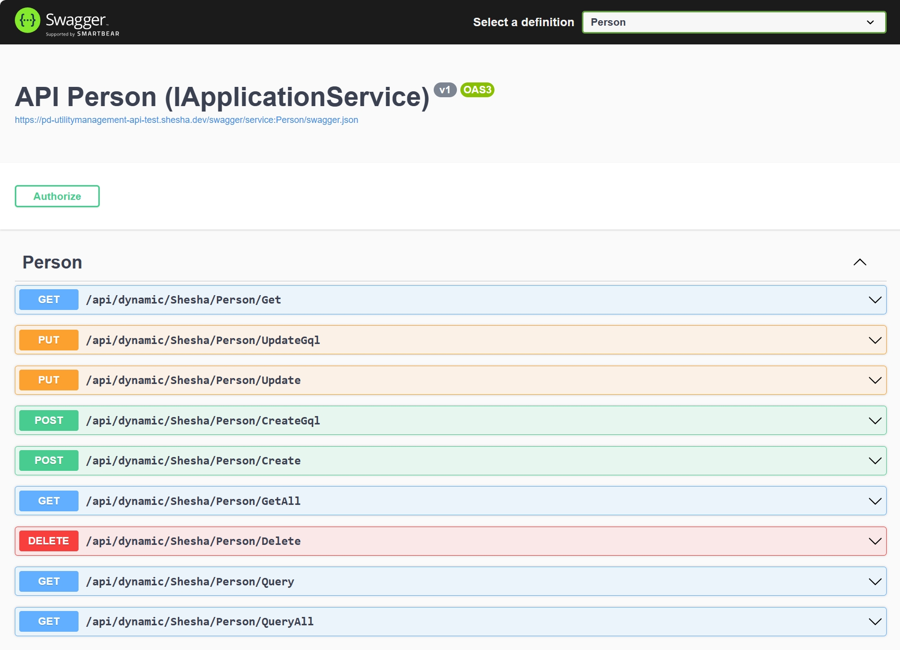
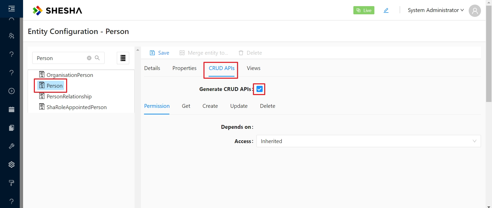

# Dynamic CRUD APIs

Shesha provides a feature to auto-generate a set of CRUD (Create, Read, Update, Delete) APIs for any selected entity. These APIs can be utilized to carry out CRUD operations on that entity. Furthermore, you can link these APIs from the form configurator, enabling you to swiftly construct a user interface for managing these entities.

## Generated APIs

As an example, the image below shows the list of generated APIs for the `Person` entity:



:::warning Depracated end-points
Please note as per [GitHub Issue 838](https://github.com/shesha-io/shesha-framework/issues/838) the following duplicative and deprecated end-points will be removed in the future: UpdateGql, CreateGql, Query, GetAll
:::

### Get
Returns a single entity by its Id
Return single entity by it's Id. Here [entity] - is a camel cased name of the entity class

### QueryAll
Returns a list of entities using GraphQL
| Argument |  Description|
|--|--|
| properties | Specifies which properties to return. The format is the same as for GQL queries e.g. `id firstName lastName`. Employing the GQL format allows you to also specify nested properties for referenced entities. For example, if you wish to also return `id firstName lastName primaryOrganisation { id name }` If left blank, all top level properties for the entity will be returned. |
| filter | Filter in [JsonLogic](https://jsonlogic.com/) format |
| quickSearch | Quick search string. This argument will probe different properties of the entity at once. It's important to note that it will only examine text, reference list, and entity reference properties. For entity reference properties, the argument will look into the display name property of any entities referred to. |
| specifications | List [specifications](/docs/fundamentals/specifications.md) to apply. |
| sorting | Comma delimited properties to sort. The format is the same as for SQL queries e.g. `firstName, lastName desc` |
| skipCount | Number of entities to skip before returning the results. |
| maxResultCount | Maximum number of entities to return in the result set. |

### Create
Creates a new entity

### Update
Updates an existing entity

### Delete
Deletes an existing entity

## Preventing the generation of CRUD APIs through code

To prevent the generation of CRUD APIs for a specific entity, simply add the `Entity` attribute to the entity class and provide the appropriate value for the  `GenerateApplicationService` parameter:
```csharp
// highlight-start
[Entity(GenerateApplicationService = GenerateApplicationServiceState.DisableGenerateApplicationService)]
// highlight-end
public class MyEntity : FullAuditedEntity<Guid>
{
      ...
}
```
## Preventing the generation of CRUD APIs through configuration
Alternatively, you may also prevent the generation of CRUD APIs through configuration. This may be preferrable if you do not have access to the source code of the entity class or if you wish to give yourself flexibility through configuration.

From your running Shesha application, go to 'Administration > Entity Configuration' on the main menu. Select the entity for which you wish to prevent the generation of CRUD APIs. Click the 'CRUD APIs' tab, then uncheck the 'Generate CRUD APIs' property as illustrated below:


## Securing CRUD APIs
To secure the generated CRUD APIs, you can use the entity configuration view to specify the required permissions for each of the CRUD APIs.
From your running Shesha application, go to 'Administration > Entity Configuration' on the main menu. Select the entity you wish to secure. Click the 'CRUD APIs' tab, then specify the required permissions for each of the CRUD APIs as illustrated below:


---
## Customizing behavior of CRUD APIs
There is a number of ways to customize the behavior of the generated CRUD APIs.

### Enforcing validation and business logic on Create and Update end-points
To enforce validation and other business logic on Create and Update operations use [Fluent Validation](/docs/fundamentals/validation#applying-validation-on-auto-generated-crud-apis).

### Customizing Querying behavior on QueryAll end-point
To 'inject' custom querying logic into the generated QueryAll end-point you implement [Specifications](/docs/fundamentals/specifications).

[//]: # (### Customizing Quick Search behavior)

[//]: # (To customize the Quick Search behvior you can implement ??? need to describe way to utilise a custom IQuickSearcher.)

# See Also
- [Custom APIs](/docs/back-end-basics/custom-apis)
- [Validation](/docs/fundamentals/validation)
- [Specifications](/docs/fundamentals/specifications)