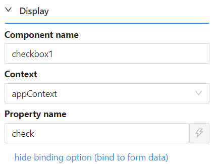

# App Context

App Context is a storage area shared by the whole application, useful for settings, configuration, or a value that needs to be shared across different parts of the application rather than kept on a single form.

See [App Context](/docs/front-end-basics/javascript-api/contexts/appContext) for the full scripting API, including how its data persists across page refreshes and how it differs from Page Context and Form Context. This page covers binding a component directly to it instead.

---

## Binding a Component to App Context

A component is bound to App Context the same way as any other context: give it a [Property Name](/docs/front-end-basics/form-components/common-component-properties#property-name-string), then set its [Context](/docs/front-end-basics/form-components/common-component-properties#context-object) property to `appContext`.



---

## Reading the Bound Value in a Script

Suppose a Checkbox component's Property Name is `check` and its Context is set to `appContext`, as in the screenshot above. Its value is then available anywhere in a script as:

```javascript
contexts.appContext.check
```

:::info
Binding several components to App Context this way lets you build a form where one field's value (for example, a checkbox) drives conditional logic on others - such as changing how many fields are shown, which are required, or whether they are enabled - since every component bound to `appContext` shares the same storage across the whole application, not just the current form.
:::
