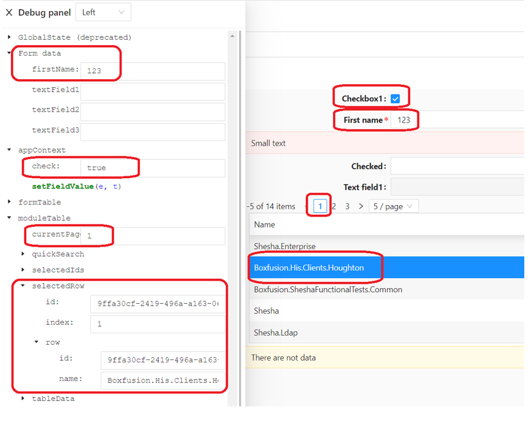

# Debug Panel

The Debug Panel lets you inspect the live state behind a form while you're building or testing it, so you can see exactly what a script or component would actually see - the form's current data, the global state, and every active context - without adding `console.log` calls.

Shesha actually has two different debug views, not one:

- A read-only panel built into the **Form Designer** canvas.
- A separate, floating panel available anywhere in the running app, opened with **Ctrl+F12**.

---

## Form Designer Debug Panel

Clicking the bug icon in the Form Designer's toolbar toggles a panel inline in the canvas. It shows the form's current data and each active context as read-only, formatted JSON.

:::note Designer only, read-only
This panel is only available while editing a form in the Form Designer - it isn't available to end users at runtime, and its values aren't editable here. To inspect and edit values live at runtime, use the Ctrl+F12 panel below instead.
:::

---

## Runtime Debug Panel (Ctrl+F12)

Press **Ctrl+F12** anywhere in a running Shesha application to open a floating, resizable debug panel (it can also be toggled through the **Toggle debug panel** configurable action, for example from a button). Unlike the Form Designer's panel, everything shown here is editable - expanding a value lets you type in a new one directly, which is useful for quickly testing how a form behaves with different data without going through the UI.

The panel shows three groups of data as expandable trees:

| Group | What it shows |
|---|---|
| `GlobalState (obsolete)` | The application's global state object. Labelled obsolete in the panel itself - avoid relying on global state for new work. |
| `Form data` | The current form's data, editable field by field. |
| One entry per active context | Every context currently available on the page (for example `pageContext`, `formContext`, or any component-provided context), each editable. |

You can drag the panel to the top, bottom, left, or right of the screen using the position dropdown in its header, and resize it by dragging its edge.

:::warning Editing here changes real state
Because the runtime panel writes directly back to form data, global state, and contexts, changes you make here take effect immediately, the same as if a script had made them. Use it for testing and diagnosis, not as a way to permanently set values a user should enter through the form itself.
:::

---

## Usage

Reach for the Debug Panel whenever you need to see what a script, component, or the form itself would actually see, instead of scattering `console.log` calls through your code or guessing at a context's shape:

- Check what fields and values are actually present in `data` at a given point, especially on entities with many properties.
- Confirm a context (`pageContext`, `formContext`, an entity Data Context, and so on) exists and holds what you expect before writing a script against it.
- Reproduce an edge case at runtime by editing a value directly in the Ctrl+F12 panel, rather than re-entering it through the UI every time.
- Verify that a scripted Hide/Visibility expression or event handler is reading the field you think it's reading.

---

## Benefits

- **No temporary logging** - inspect live state directly instead of adding and later removing `console.log` statements.
- **Faster iteration when testing** - the runtime panel lets you edit form data, global state, and context values directly, so you can try different inputs without re-entering them through the UI each time.
- **One tool for both design-time and runtime state** - the Form Designer panel and the Ctrl+F12 panel between them cover what a form's data and contexts look like whether you're building the form or running it.
