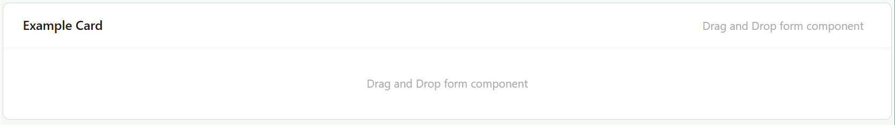
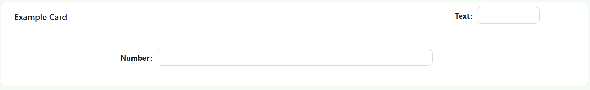

# Card

The Card component wraps other components in a styled container with an optional heading, giving you a visually distinct section on the form. Use it to group related fields together and separate them visually from the rest of the form.

:::info Two separate drop areas
A Card has two independent places to drop components: the main **content** area, and a **header** area next to the heading text (useful for a small action button or icon alongside the title). Dragging a component onto the header area keeps it separate from the card's body.
:::

---

## Properties

The following properties are available to configure the behavior of the component from the form editor (this is in addition to [common properties](/docs/front-end-basics/form-components/common-component-properties)). Card groups its settings into **Common** and **Appearance** tabs (plus a **Security** tab holding only the standard Permissions setting, not covered further here).

### Common

#### **Heading** `string`

The text displayed at the top of the card. This is a scriptable field, so it can be computed rather than fixed.

#### **Hide Heading** `boolean`

Hides the heading area entirely, even if a Heading value is set and even if components have been dropped into the header area.

#### **Hide When Empty** `boolean`

Hides the card when all of its child components are hidden or have no content.
