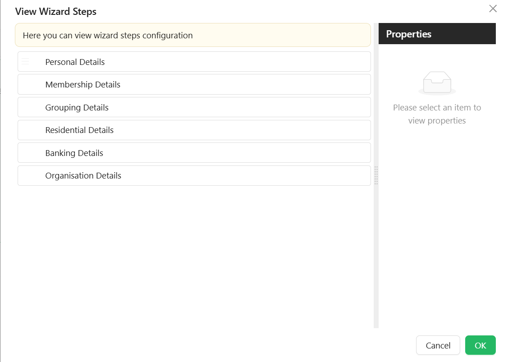

# Wizard

import LayoutBanners from './LayoutBanners';

The Wizard component enables multi-step forms by segmenting fields across several pages with navigation controls. It's ideal for complex data entry processes where progressive disclosure improves the user experience.

[//]: # '<iframe width="100%" height="500" src="https://pd-docs-adminportal-test.shesha.dev/shesha/forms-designer/?id=747834b4-9ef8-4088-a951-e976776b19ec" title="Wizard Component" ></iframe>'


## **Get Started**

<LayoutBanners url="https://app.guideflow.com/embed/3r3w71vf9k" type={1}/>
___

## **Properties**

### Common

#### **Wizard Type** `string`

Sets the layout style:

- Default *(default)*
- Navigation

#### **Direction** ``object``
Defines orientation:

- Horizontal (default)
- Vertical

#### **Label Placement** ``object``

Controls how labels are positioned:

- Horizontal *(default)*
- Vertical

#### **Default Active Step** ``object``
The step index that should be active on load.

#### **Configure Steps**

List of steps with their titles, icons, and content configuration.
- **Component Name** `string` – Identifier for the component in that step
- **Title** `string` – Step title shown in the wizard UI.
- **Subtitle** `string`- Step subtitle is a secondary heading or a supporting piece of text that provides additional context or information related to the main title.
- **Description** `string` - Step description is a more extensive piece of text that elaborates on the details introduced in the title and subtitle. It provides a comprehensive explanation or additional information.
- **Key** `string` – Unique key for the step.
- **Icon** `object` - Users can select an icon to be displayed on each wizard step.
- **Allow Cancel** `boolean` - When set to true, this property enables a cancel button for the wizard step. The behavior is determined based on the configurations defined in the cancel event.
- **Can Skip To**`boolean` – Whether this step can be skipped to from other steps.

#### Button Titles
Each button title can be customized to meet business requirements. Each Wizard Step has 4 button tabs:

- **Next Button**
    - Text `string` – This is the title of the Next button.
    - Before Next Action `function` - An action triggered before the step moves to the next one.
    - After Next Action `function` - An action triggered after the step has moved to the next one.
- **Back Button**
    - Text `string` – This is the title of the Back button.
    - Before Back Action `function` - An action triggered before the step moves to the previous one.
    - After Back Action `function` - An action triggered after the step has moved to the previous one.
- **Done Button**
    - Text `string` – This is the title of the Done button.
    - Before Done Action `function` - An action triggered before the wizard completes the final step.
    - After Done Action `function` - An action triggered after the wizard has completed the final step.
- **Cancel Button**
    - Text `string` – This is the title of the Cancel button.
    - Before Cancel Action `function` - An action triggered before the cancel event occurs.
    - After Cancel Action  `function` - An action triggered after the cancel event occurs.

_**These button titles all have a custom enabled function**_.

_After any of the button events, you can handle both success and failure._

#### On Before Render `function` -  An action triggered before the step renders.

#### Button Custom Enabled `function`

- This allows for a custom `javascript` code to be added to determine whether a button is enabled. For instance, you may want to prevent users from proceeding before entering mandatory fields. In such cases, the button can be disabled and only enabled after the mandatory fields are captured.

_In this example, the fields `firstName`, `lastName` and `emailAddress1` are manadatory and movement to the next step should be restricted if they have not been captured_

```javascript
if (form.formMode != "designer") {
  //this is to prevent movement to the next step while on the form designer
  return (
    isValidProperty(data.firstName) &&
    isValidProperty(data.lastName) &&
    isValidProperty(data.emailAddress1)
  );
}

function isValidProperty(value) {
  return value !== undefined && value !== "";
}
```

#### Using JS code
You can use JS script of some controls (Buttons, etc.) to manage Wizard Component

`contexts.wizardName.current` - get the current step index (zero-based)
`contexts.wizardName.visibleSteps` - get the list of visible steps (object `IWizardStepProps`)

```javascript
interface IWizardStepProps extends IConfigurableItemBase {
  id: string;
  icon?: string;
  key: string;
  title: string;
  subTitle: string;
  description: string;
  allowCancel?: boolean;

  cancelButtonText?: string;
  nextButtonText?: string;
  backButtonText?: string;
  doneButtonText?: string;
  ...
}
```

Actions to move between steps:
- `contexts.wizardName.api.next()` - to the next step
- `contexts.wizardName.api.back()` - to the previous step
- `contexts.wizardName.api.done()` - finish the wizard (execute Done configurable actions)
- `contexts.wizardName.api.cancel()` - canel the wizard (execute Cancel configurable actions)
- `contexts.wizardName.api.setStep(index)` - move to the step with Index (will be executed `On Before Render` configurable action)
___

#### **Hide** `boolean`  
Controls the visibility of the entire wizard component.

___

### Appearance

#### **Font** ``object`` 

Customize how your wizard look. Choose the font family, size, weight, and color.

#### **Dimensions** ``object``

Set the width, height, min/max sizes of the component.

#### **Border** ``object``

Personalize the borders:
- Set border width, color, and style
- Round the corners for a softer touch

#### **Background** ``object``

Pick your flavor of background:

- Color
- Gradient
- Image URL
- Uploaded Image
- Stored File

#### **Shadow** ``object``

Give depth with adjustable shadows:

- Offset, Blur, Spread, Color

#### **Margin & Padding** ``object``

Fine-tune spacing inside and around the component.

####  **Custom Styles** ``function``

Inject your own CSS styles via JavaScript (must return a style object).

#### **Additional Styles** ``object``

- Button Layout ``string``: Layout direction of navigation buttons. *(Left, Right, Space between)*

- Primary Color `object`: Main highlight color.

- Primary Text Color `object`: Text color for primary elements.

- Secondary Color `object`: Secondary accent color.

- Secondary Text Color `object`: Text color for secondary elements.

___

## **Advanced Wizard**

<LayoutBanners url="https://app.guideflow.com/embed/dkdwl20a9r" type={1}/>
