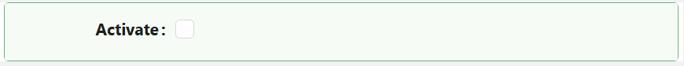

# Checkbox

The Checkbox component provides a simple control that lets users make a binary choice - checked or unchecked. It binds to a boolean field on your entity.

---

## Properties

The following properties are available to configure the behavior of the component from the form editor (this is in addition to [common properties](/docs/front-end-basics/form-components/common-component-properties)).

___

### Appearance

#### **Enable Style On Readonly** `boolean`

When off (the default), a read-only checkbox drops all visual styling except typography, showing only the check mark and its text. Turn this on to keep the checkbox's full styling (border, background, shadow, and so on) even when it is read-only.

The section normally named **Font** is labelled **Check Mark** here, and exposes **Size**, **Weight**, and **Color**.
