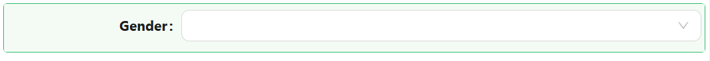
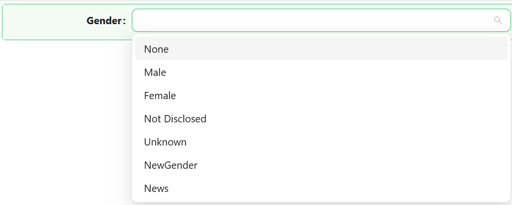

# Dropdown

The Dropdown component lets users pick one or more values from a list. The list can be a fixed set of label/value pairs you define yourself, or a reference list defined on the backend, and the component can display its selected values as plain text or as coloured tags.

---

## Properties

The following properties are available to configure the behavior of the component from the form editor (this is in addition to [common properties](/docs/front-end-basics/form-components/common-component-properties)).

### Data

#### **Mode** `object`

Whether the user can pick a single value (**Single**) or several at once (**Multiple**).

#### **Data Source Type** `object`

Where the list of options comes from:

| Option | Description |
|---|---|
| **Values** | A fixed list of label/value pairs you define directly on the component. |
| **Reference list** | The options come from a reference list defined on the backend. |

:::note No URL option in the designer
The underlying data model allows a `'url'` data source type, but the live settings panel only ever offers **Values** and **Reference list** as choices - there is currently no way to select a remote URL as a Dropdown's data source from the designer.
:::

#### **Values** `array`

Only shown when Data Source Type is **Values**. Define each option as a label, a value, and optionally a colour and an icon.

#### **Reference List** `object`

Only shown when Data Source Type is **Reference list**. Pick the reference list this Dropdown draws its options from.

#### **Items Filter** `object`

Only shown when Data Source Type is **Reference list**. Restricts which items of the reference list are offered, using the same query builder used elsewhere in Shesha.

#### **Value Format** `object`

Only shown when Data Source Type is **Reference list**. Controls what gets stored in the bound property:

| Option | Description |
|---|---|
| **Simple item value** | Stores the reference list item's raw integer value. |
| **Reference list item** | Stores the full reference list item object. |
| **Custom** | Reveals **Key Value** and **Custom Value** script fields, letting you compute the stored value yourself. |

#### **Item Custom Label** `function`

Only shown when Data Source Type is **Reference list**. A script that returns the label to display for an item, overriding the reference list item's own name.

#### **Disable Item Value** `boolean`

Only shown when Data Source Type is **Reference list**. When enabled, reveals **Disabled Values**, a list of item values that appear in the list but cannot be selected.

#### **Ignored Values** `string`

A comma or array-style list of item values to exclude from the list entirely (rather than just disabling them). This field appears twice in the live settings panel - once inside the Reference list options, and once further down the Data tab gated behind Disable Item Value - both write to the same property.

___

### Appearance

The Appearance tab starts with two settings that apply regardless of display mode:

#### **Enable Style On Readonly** `boolean`

When the component becomes read-only, this controls whether its full configured styling still applies, or only its font and dimensions. Hidden when Mode is Single and Display Style is Tags.

#### **Display Style** `object`

Whether selected values are shown as **Plain text** or as **Tags** (coloured pill-shaped labels).

When Display Style is **Tags** and Mode is **Single**, the component's standard appearance controls are replaced entirely by a **Custom Tag Styles** panel: its own Font, Dimension, Border, Background (with a **Show Solid Color** toggle switching between a fully-coloured tag and a subtle tint-with-border look), Shadow, and Style script - all scoped to the tag's own appearance rather than the component's outer box. Switching Display Style back to **Plain text** (or Mode to **Multiple**) restores the component's standard appearance controls in place of that panel.
