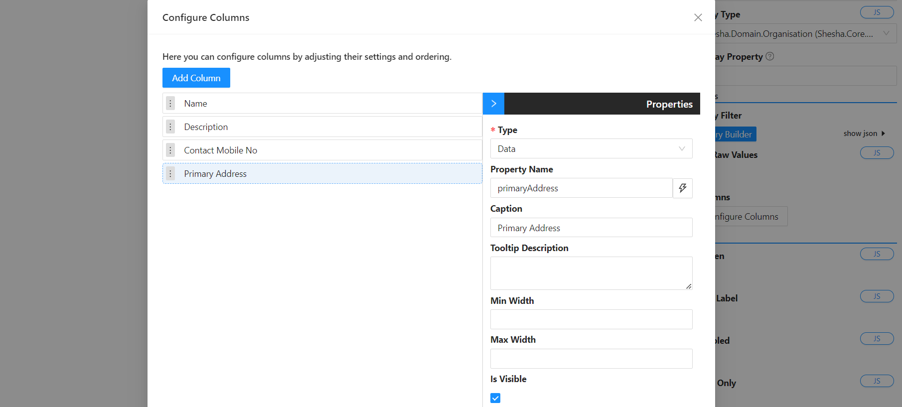
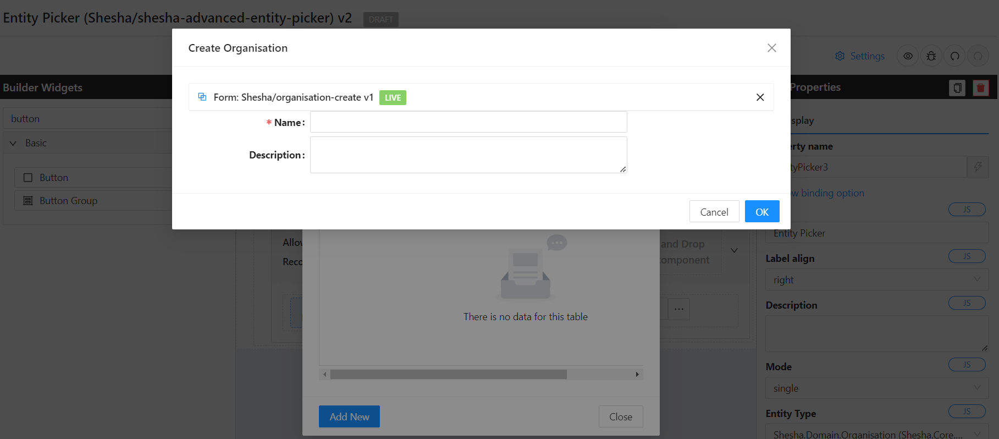

# Entity Picker

EntityPicker displays an entity instance in a text field and performs actions when the user clicks buttons on the right.

[//]: # '<iframe width="100%" height="500" src="https://pd-docs-adminportal-test.shesha.dev/shesha/forms-designer/?id=78cf2cab-724b-43cb-a370-7b71e2f215e6" title="Entity Picker Component" ></iframe>'

Use EntityPicker if:

- The field value is a reference to an entity instance.
- Users need to select or create an entity instance via the lookup screen or enter a specific value.

## Properties

The following properties are available to configure the behavior of the component from the form editor (this is in addition to [common properties](/docs/front-end-basics/form-components/common-component-properties)).

### Entity Type

 Drop down of all the entities available in the systems to bind to the component as options.

### Columns

 Adding columns relevant to your entity selected so you can see more information of the field to help you make the correct selection.

### Allow New Record

 When this is toggled on, it allows for the creation of an entity instance via the lookup screen.

- #### Dialog Settings

  - **Title**

    - This is the title of the dialog that will render while within the lookup screen.

  - **Modal Form**

    - This brings a dropdown list of all the forms that are available in the system and can be rendered as a dialog.

  - **Show Modal Buttons**

    - If this is toggled on, this provides the ability to make API calls with information contained in your dialog form.

  - **Submit Http Verb**

    - This is a dropdown of the different API calls that can be made from the dialog data. Options: POST, PUT. This will use the POST or PUT settings as specified in your dialog form.

  - **Dialog Width**
    - This specifies the width of the rendered dialog. Options: Small, Middle, Large, Custom.
