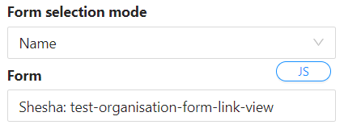
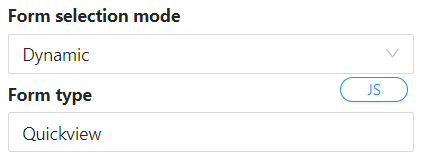
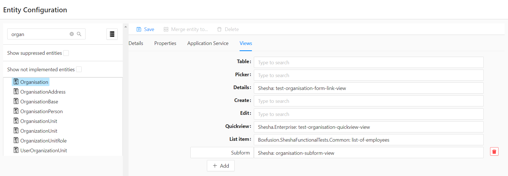

# Entity Reference

Entity Reference component renders an entity reference (foreign key reference) as links that allows for different navigation/display options from there.

In the below example, the entity reference component was configured with a name of 'organisation', and the 'autocomplete' field was dragged onto the designer as a data source for the entity reference since we are on the form designer.

[//]: # '<iframe width="100%" height="500" src="https://pd-docs-adminportal-test.shesha.dev/shesha/forms-designer/?id=b0bf7ab6-5ef8-4a76-8610-fcac32b5953b" title="Entity Reference Component" ></iframe>'

## Properties

The following properties are available to configure the behavior of the component from the form editor (this is in addition to [common properties](/docs/front-end-basics/form-components/common-component-properties).

### Get Entity Url

 Endpoint Url to use in the cases where you would want to use a different endpoint than the one that is stored in the meta-data.

### Entity Type

 This brings a dropdown of entities available in the system in the cases where you would want to use a different entity than the one that is stored in the meta-data.

### Entity Reference Type

- Options:
  - **Navigate Link**
    - Entity display name is a hyperlink that will navigate the user to the specified view.
  - **Quickview**
    - Entity display name displays the specified form in a Quickview on hover.
  - **Dialog**
    - Entity display name displays the specified form in a Dialog onClick.
    - **Title**
      - Title of the dialog.
    - **Show Modal Buttons**
      - If this is toggled on, this provides the ability to make API calls with information contained in your dialog form.
    - **Submit Http Verb**
      - This is a dropdown of the different API calls that can be made from the dialog data. Options: POST, PUT. This will use the POST or PUT settings as specified in your dialog form.
    - **Dialog Width**
      - This specifies the width of the rendered dialog. Options: Small, Middle, Large, Custom.

### Form Selection

- Options:

  - **Name**

    - User selects a specific form to drill-down into.

    

  - **Dynamic**

    - User selects the form type. These forms are specified in the 'Entity Configurations' view, which provides a centralized repository of the different types of views and which form should be rendered based on the scenario.

    
    
