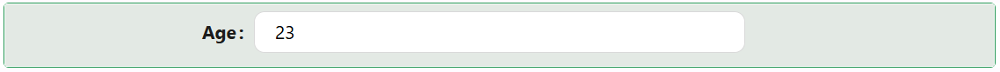

# NumberField

The NumberField component is an input for numeric data entry. It supports minimum/maximum bounds, a configurable step increment, optional high-precision decimals, and a prefix or suffix (text or icon) shown alongside the value, such as a currency symbol or unit.

---

## Properties

The following properties are available to configure the behavior of the component from the form editor (this is in addition to [common properties](/docs/front-end-basics/form-components/common-component-properties)).

### Common

:::tip Binding to an entity property fills in Min/Max automatically
When Property Name is bound to a numeric entity field, NumberField automatically copies that field's Label, Description, Min Value, and Max Value from the entity's metadata. You can still override any of these manually afterwards.
:::

The next two properties can be set together to show text and/or an icon at the start of the input, before the number - for example a currency symbol. The icon renders first, followed by the text.

#### **Prefix** `string`

Text shown at the start of the input, before the number.

#### **Prefix Icon** `string`

An icon shown at the start of the input, before the text.

The next two properties work the same way for the end of the input, after the number - for example a unit like `%` or `kg`. The text renders first, followed by the icon.

#### **Suffix** `string`

Text shown at the end of the input, after the number.

#### **Suffix Icon** `string`

An icon shown at the end of the input, after the text.

#### **High Precision** `boolean`

Enables high-precision decimal entry. Toggling this swaps the **Step** field below it from a plain number input to a text input, so you can enter a step value with more decimal places than a numeric input allows (for example `0.001`).

#### **Step** `number` / `string`

The increment applied when using the input's up/down controls. This field's type follows **High Precision**: a plain number when High Precision is off, or a free-text value when it is on.

___

### Validation

#### **Min Value / Max Value** `number`

Restrict entries to within a specified numeric range. If Property Name is bound to an entity field, these are pre-filled from that field's metadata but can be overridden.

___

### Appearance

#### **Enable Style On Readonly** `boolean`

By default, most styling (other than font and dimensions) is dropped when the component becomes read-only, so it blends in as plain text. Enable this to keep the full styling - border, background, shadow - even when the component is read-only.
