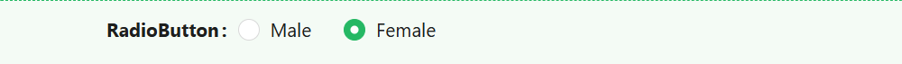
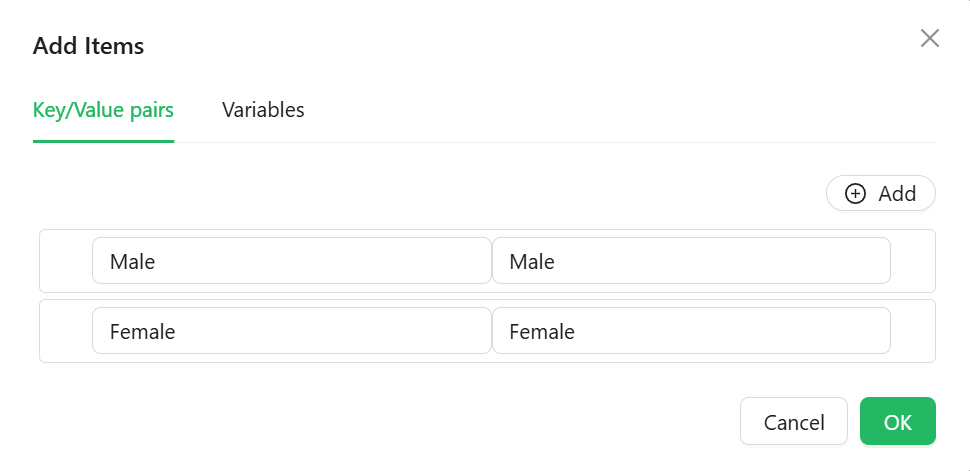

# Radio

The Radio component lets users pick a single option from a small, always-visible set of choices. Its options can come from a fixed list you type in, a reference list, or a URL you fetch at runtime.



---

## Properties

The following properties are available to configure the behavior of the component from the form editor (this is in addition to [common properties](/docs/front-end-basics/form-components/common-component-properties)).

___

### Data

#### **Data Source Type** `object`

Chooses where the radio options come from:

| Option | Description |
|---|---|
| **Values** | Define label/value pairs directly in a dialog editor. |
| **Reference list** | Populate options from a selected reference list. |
| **API URL** | Fetch options from a custom endpoint at runtime. |

#### **Items** `object`

Only shown when Data Source Type is **Values**. Opens a dialog editor for typing in label/value pairs directly.



#### **Reference List** `object`

Only shown when Data Source Type is **Reference list**. Picks which reference list supplies the options. If the component's Property Name is bound to a reference-list-typed entity property, this is filled in automatically.

#### **Data Source URL** `function`

Only shown when Data Source Type is **API URL**. A script that returns the URL to fetch options from.

#### **Reducer Function** `function`

Only shown when Data Source Type is **API URL**. A script that reshapes the raw fetched response into the label/value pairs the component needs.

**Form type to use:** Any form type - Radio is available everywhere standard script variables are.

**Example - Map a custom API response into label/value pairs:**

```javascript
return data.map(item => ({ label: item.displayName, value: item.code }));
```

___

### Appearance

Radio's Appearance tab is unusually thin - it only exposes:

#### **Enable Style On Readonly** `boolean`

When off (the default), the component drops most of its visual styling once it becomes read-only, keeping only its typography. Turn this on to keep the full style applied even when read-only.

#### **Direction** `object`

Lays the options out **Horizontal** (the default) or **Vertical**.

#### **Style** `function`

A script that returns the style of the element as an object. Alongside Direction and Enable Style On Readonly, this is the only styling control for this component.
