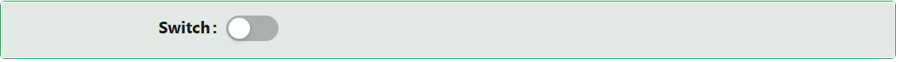

# Switch

The Switch component gives users a simple ON/OFF toggle. It binds to a boolean field on your entity.

---

## Properties

The following properties are available to configure the behavior of the component from the form editor (this is in addition to [common properties](/docs/front-end-basics/form-components/common-component-properties)).

### Appearance

#### **Enable Style On Readonly** `boolean`

When the component becomes read-only, this removes all visual switch styling except typography, so a read-only Switch reads as plain text rather than a disabled toggle control.

#### **Size** `object`

Select the size of the switch. This control sits inside a panel labelled **Dimensions** in the live form editor - despite the name, that panel holds no width/height controls, only this dropdown:

| Option | Behaviour |
|---|---|
| **Small** | A compact version of the switch. |
| **Default** | The standard size for the switch. |

Unlike the general [Size](/docs/front-end-basics/form-components/common-component-properties#size-object) setting described in the common properties, Switch only offers these two options - there is no Large size.

#### **Style** `function`

A script returning a style object.

:::note
Switch's Appearance tab exposes only Size and a Style script.
:::
