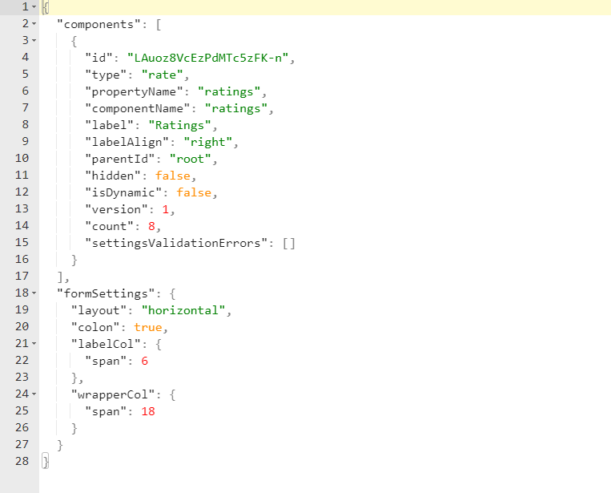
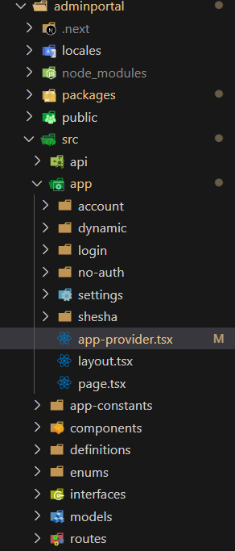

# Custom Components

The Shesha Form Builder is a powerful feature that includes a variety of form components to cover a wide range of common scenarios. However, given the diversity of use cases, it's not feasible to address all of them. Therefore, Shesha provides an option to develop custom components for any unique requirements. These custom components can be seamlessly integrated withing the Form Builder, enabling you to easily add them to any form through the drag-and-drop interface.

## Background

Before diving into the code, we need to briefly mention a few topic areas.

- The form is assembled using a JSON schema. Once this JSON data is available it is injected into the Form Builder and interpreted to render specific components with exact configurations.

  
  

> **NOTE**: It is important to note that in the JSON schema in the above image, two properties are depicted (`components`, `formSettings`). Also take note that the components property is an `array` and if we had more than one component in the UI form it would be shown in this array.

## Folder Structure

- Looking at the file structure, we have gone with the [monorepo](https://monorepo.tools/) approach. NPM allows for [workspaces](https://dev.to/ynwd/how-to-create-react-monorepo-with-npm-workspace-webpack-and-create-react-app-2dhn) to be used in a single project. The use of workspaces allows us to share dependencies (node_modules) between projects/modules in a single application.
- The recommended naming conventions is to name the root workspace directory as `packages` and create all relevant modules in this `packages` directory.

  

  _Above image shows the `packages` folder in the root of the `adminportal` directory_

- Inside the `packages` directory we can see that only one module exists, namely the `his` module.
- The `index.ts` file inside of the `src` folder is the entry point to the packaged modules, meaning that whatever is exposed here can be imported from this module.

  

- By opening the `allComponents` file as shown in the image below, we can see the list of exposed components to the Shesha Form Builder.
  <!-- figure 5 -->

  
  <!-- figure 7 -->

  

- An array is the data structure used for `allComponents`, this allows us to group components and create multiple component modules if needed.
- The array is typed with a IToolboxComponentGroup interface which enforces that we follow the correct pattern. It is recommended that allComponents be typed as shown in the image below
  <!-- figure 5 -->
  

_The square bracket after the interface means it is an array of the [IToolboxComponentGroup](https://github.com/shesha-io/shesha-framework/blob/d4959da52f3285067f3269d7f9a14a0259281afb/shesha-reactjs/src/interfaces/formDesigner.ts) interface._

## Implementation

- A simple example was constructed for demo purposes
  <!-- figure 6 -->

  

- `SampleComponent` is an object which implements the [IToolboxComponent](https://github.com/shesha-io/shesha-framework/blob/d4959da52f3285067f3269d7f9a14a0259281afb/shesha-reactjs/src/interfaces/formDesigner.ts) interface, this is to ensure consistency.

## Type

- A key which is used to find specific components, it is essential that this is unique

## Name

- Property name is displayed on the components toolbox and is often the default value of the label once dragged to the form

## Icon

- Icon property refers to the selected icon on the toolbox

  <!-- figure 7 -->

  

## Form Configuration

- Form configuration are the configurations that render the side menu or metadata of the component

  <!-- figure 8 -->

  
  <!-- figure 9 -->

  

- [DesignerToolbarSettings](https://github.com/shesha-io/shesha-framework/blob/d4959da52f3285067f3269d7f9a14a0259281afb/shesha-reactjs/src/interfaces/toolbarSettings.ts) is a class that assists to create the configuration. Simply append the relevant method to the class to build the configuration and pass the relevant options to the method. Import the configuration settings and inject it to the builder.

_shown on lines 10, 40, 41_

  <!-- figure 6 -->

## Factory

- The `factory` property is arguably the most important property implemented from the `IToolboxComponent` interface. In essence, the property returns a JSX element and is what will be rendered in the forms.
- Property `factory` is actually a method that returns a JSX element/component, the first and only parameter is an object of type [ComponentFactoryArguments](https://github.com/shesha-io/shesha-framework/blob/d4959da52f3285067f3269d7f9a14a0259281afb/shesha-reactjs/src/interfaces/formDesigner.ts).
- We will be focusing on the model property that is inside the `ComponentFactoryArguments` interface and neglect the rest of the properties.
- From our parameter we destructure the model property. Property of model is passed to the [ConfigurableFormItem](https://github.com/shesha-io/shesha-framework/blob/d4959da52f3285067f3269d7f9a14a0259281afb/shesha-reactjs/src/components/formDesigner/components/formItem.tsx) component

    <!-- figure 6 -->

  _shown on line 25_

  

> **NOTE**: It is important to note that `ConfigurableFormItem` is a form item and is responsible for handling state, validation, visibility and many more features on the Shesha Form Builder.

## Model

- The model property is the values which were set in component form configuration

  <!-- figure 8 -->

  

- Once this is set the values are available on the model property
  <!-- figure 6 -->

  _shown on line 17_

  

- It is important to note the type of the model, the model is an object of type ISampleComponentProps. This is passed as a generic type on the ComponentFactoryArguements interface.

  <!-- figure 10 -->

  

Rending of the `factory` property includes the `ConfigurableFormItem` component as the top parent, this is not mandatory only but done as preference. The children of `ConfigurableFormItem` return a function of parameters `value` and `onChange`. value is the current value of the active component, `onChange` is the event which will trigger the value to change

  <!-- figure 6 -->

_shown on line 26_

The function which is the child of `ConfigurableFormItem` is required to return the component which will be rendered on the form builder. Direct values can be passed down or muted depending on the specification, in the example used the values from model were directly used in the components

  <!-- figure 6 -->

_shown on lines 28, 29, 30_

_See working example below_

  <!-- figure 7 -->

## Init Model

- Initial values can be set using the initModel property. These values will be initialized on the form configuration

    <!-- figure 6 -->

  _shown on line 36_

  
  <!-- figure 8 -->

  

## Exposing Component

- Navigate to the `app.tsx` file from the root directory of the `adminportal` directory. `src` > `pages` > `app.tsx`
  <!-- figure 11 -->

  

- This file includes the Shesha [providers](https://react-redux.js.org/api/provider) which are responsible for the majority functionality on the Shesha Builder.
- Import allComponents from the relevant modules
  <!-- figure 7 -->

  

- Remember that `allComponents` is an array, either spread the values to a variable or pass it to the `toolboxComponentGroups` on the `ShaApplicationProvider`
