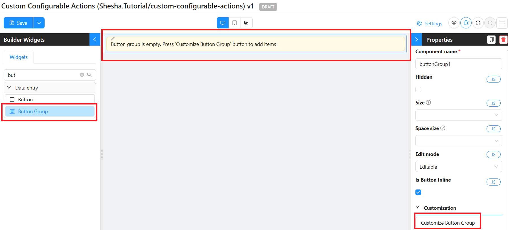
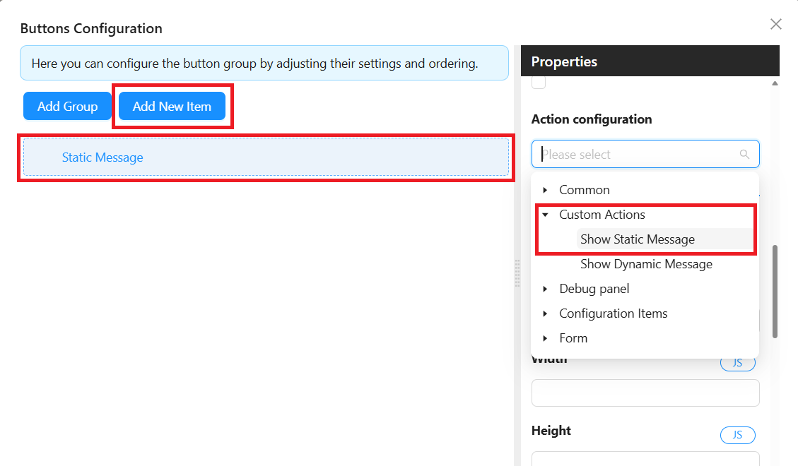
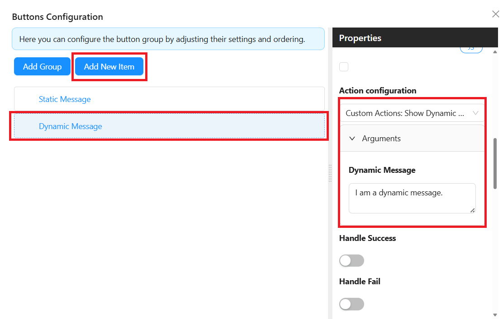

# Custom Configurable Actions

## Overview

These are configured actions to be triggered upon button click. The custom configurable actions feature demonstrates how to create reusable and flexible actions within a low-code framework using hooks. By leveraging configurable actions, developers can create actions (static and dynamic) that are flexible enough to be reused across different parts of the application without duplicating code. These actions are particularly useful in low-code environments where both technical and non-technical users may need to configure functionality easily.

The implementation of this example spans across five key files:

- **model.tsx**: Defines constants for configurable actions.
- **static-action.tsx**: Implements the logic for showing a static message.
- **dynamic-action.tsx**: Implements the logic for showing a dynamic message, which can be personalized based on user input.
- **dynamic-action-settings.json**: Contains form configuration settings for capturing dynamic input.
- **custom-configurable-actions-processor.tsx**: Centralizes and invokes the actions for processing.

## Benefits

1. **Reusability**: Configurable actions can be applied across multiple components and contexts without needing to rewrite the logic.
2. **Flexibility**: They allow non-technical users or administrators to configure actions (e.g., showing messages) via a user-friendly interface without modifying the underlying code.
3. **Separation of Concerns**: Configurable actions separate the business logic (what actions are performed) from the user interface (how actions are presented), making the application easier to maintain and extend.
4. **Customization**: The dynamic actions allow for input customization at runtime, which can adapt to the needs of specific users or contexts.
5. **Low-Code Friendly**: These actions make it easier to integrate new features within a low-code platform, where actions can be exposed to end users with minimal coding required.

## Implementation Structure

```plaintext
src/
└── components/
    └── configurable-actions/
        ├── model.tsx
        ├── static-action.tsx
        ├── dynamic-action.tsx
        ├── dynamic-action-settings.json
        └── custom-configurable-actions-processor.tsx
    app/
    └── app-provider.tsx
```

### model.tsx

In this file, we define constants that represent the owner of the actions and the types of actions available:

```javascript
export const CUSTOM_CONFIGURABLE_ACTIONS_OWNER = 'Custom Actions';
export const CUSTOM_CONFIGURABLE_ACTIONS = {
    STATIC: 'Show Static Message',
    DYNAMIC: 'Show Dynamic Message'
};
```
- **CUSTOM_CONFIGURABLE_ACTIONS_OWNER**: Represents the owner of the actions, set as `Custom Actions`.
- **CUSTOM_CONFIGURABLE_ACTIONS**: This object contains two properties:
        - **STATIC**: A key representing a static message action.
        - **DYNAMIC**: A key representing a dynamic message action.

### static-action.tsx

This file implements the logic for showing a static message using the `useConfigurableAction` hook. This action is executed without requiring any user input.

``` javascript
import { useConfigurableAction } from "@shesha-io/reactjs";
import { CUSTOM_CONFIGURABLE_ACTIONS, CUSTOM_CONFIGURABLE_ACTIONS_OWNER } from "./model";
import { message } from "antd";

export const useShowStaticMessageAction = () => {
    useConfigurableAction({
        owner: CUSTOM_CONFIGURABLE_ACTIONS_OWNER,
        ownerUid: CUSTOM_CONFIGURABLE_ACTIONS_OWNER,
        name: CUSTOM_CONFIGURABLE_ACTIONS.STATIC,
        hasArguments: false,
        executer: () => {
            message.info('This is a static message');
            return Promise.resolve();
        }
    }, []);
};
```
- **useConfigurableAction**: This hook registers the action, with the following parameters:
    - **owner**: Identifies the owner of the action (`CUSTOM_CONFIGURABLE_ACTIONS_OWNER`).
    - **name**: The name of the action (`STATIC` from `CUSTOM_CONFIGURABLE_ACTIONS`).
    - **hasArguments**: Set to `false`, indicating that no arguments are required to execute this action.
    - **executer**: This function is the core logic for the action, which in this case displays a static message using `message.info`. It returns a `Promise` that resolves once the action is executed.

### dynamic-action.tsx

This file implements a more complex action that accepts user input via a dynamically configured form. The dynamic message is personalized based on both user input and the current user's details from the execution context.

``` javascript
import { FormMarkup, useConfigurableAction } from "@shesha-io/reactjs";
import { CUSTOM_CONFIGURABLE_ACTIONS, CUSTOM_CONFIGURABLE_ACTIONS_OWNER } from "./model";
import { message } from "antd";
import settingsJson from './dynamic-action-settings.json';

export interface IDynamicMessage {
    dynamicMessage: string;
}

const settingsMarkup = settingsJson as FormMarkup;

export const useShowDynamicMessageAction = () => {
    useConfigurableAction<IDynamicMessage>({
        owner: CUSTOM_CONFIGURABLE_ACTIONS_OWNER,
        ownerUid: CUSTOM_CONFIGURABLE_ACTIONS_OWNER,
        name: CUSTOM_CONFIGURABLE_ACTIONS.DYNAMIC,
        argumentsFormMarkup: settingsMarkup,
        hasArguments: true,
        executer: (actionArgs, context) => {
            const { dynamicMessage } = actionArgs;
            const { application: { user }} = context;
            message.info(`Hello ${user.userName}, ${dynamicMessage}`);
            return Promise.resolve();
        }
    }, []);
};

```

- **IDynamicMessage**: Defines the structure of the action arguments. In this case, it includes one field: `dynamicMessage`.
- **settingsMarkup**: Loads the form configuration for the dynamic message action from the `dynamic-action-settings.json` file.
- **useConfigurableAction**: Similar to the static message action, but with key differences:
    - **hasArguments**: Set to `true`, indicating that the action requires input.
    - **argumentsFormMarkup**: Specifies the form used to collect input (loaded from the JSON file).
    - **executer**: Accepts two parameters:
        - **actionArgs**: The arguments provided by the user through the form. Here, it extracts `dynamicMessage` from the input.
        - **context**: The execution context, which includes information about the current application and user. It extracts the userName from the `context` and personalizes the message with both the user’s name and the dynamic message.
- The executer then displays a personalized message using message.info and resolves the Promise.

### dynamic-action-settings.json

This JSON file defines the structure of the form that captures the input for the dynamic action.

``` json
{
    "components": [
        {
            "id": "d498779d-012a-4c6a-82a9-77231245ae28",
            "type": "textArea",
            "name": "dynamicMessage",
            "parentId": "root",
            "label": "Dynamic Message"
        }
    ],
    "formSettings": {
        "layout": "horizontal",
        "colon": true,
        "labelCol": {
            "span": 6
        },
        "wrapperCol": {
            "span": 18
        },
        "version": 1
    }
}
```

- **components**: Defines the form fields used in the action.
    - The dynamic message input is a `textArea` field labeled as **Dynamic Message** and has the `name` **dynamicMessage**, which corresponds to the argument passed in the `executer`.
- **formSettings**: Specifies the layout and appearance of the form, including how labels and input fields are displayed.

### custom-configurable-actions-processor.tsx

This component is the entry point that invokes both the static and dynamic actions when it is rendered.

``` javascript
import { FC, PropsWithChildren } from "react";
import { useShowStaticMessageAction } from "./static-action";
import { useShowDynamicMessageAction } from "./dynamic-action";

export const CustomConfigurableActionsAccessor: FC<PropsWithChildren<{}>> = ({ children }) => {
    useShowStaticMessageAction();
    useShowDynamicMessageAction();

    return (
        <>{children}</>
    );
};
```

- **CustomConfigurableActionsAccessor**: A functional component that triggers both `useShowStaticMessageAction` and `useShowDynamicMessageAction` when rendered. This effectively registers the actions within the application.
- It renders its child components (passed as `children`) after registering the actions.

#### app-provider.tsx

The final step would be to wrap the `CustomConfigurableActionsAccessor` around any children you would like to have the additional configured actions. In this example, we will be wrapping it around the `StoredFilesProvider`.

``` javascript
"use client";

import React, { FC, PropsWithChildren } from "react";
import {
  GlobalStateProvider,
  ShaApplicationProvider,
  StoredFilesProvider,
  useNextRouter,
} from "@shesha-io/reactjs";
import { AppProgressBar } from "next-nprogress-bar";
import { useTheme } from "antd-style";
import { CustomConfigurableActionsAccessor } from "@/components/configurable-actions/custom-configurable-actions-processor";

export interface IAppProviderProps {
  backendUrl: string;
}

export const AppProvider: FC<PropsWithChildren<IAppProviderProps>> = ({
  children,
  backendUrl,
}) => {
  const nextRouter = useNextRouter();
  const theme = useTheme();

  return (
    <GlobalStateProvider>
      <AppProgressBar height="4px" color={theme.colorPrimary} shallowRouting />
      <ShaApplicationProvider
        backendUrl={backendUrl}
        router={nextRouter}
        noAuth={nextRouter.path?.includes('/no-auth')}
      >
        <CustomConfigurableActionsAccessor>
            <StoredFilesProvider baseUrl={backendUrl} ownerId={""} ownerType={""}>
                {children}
            </StoredFilesProvider>
        </CustomConfigurableActionsAccessor>
      </ShaApplicationProvider>
    </GlobalStateProvider>
  );
};
```

## Results

1. Drag in a `Button Group` component and click `Customize Button Group`



2. Add a `New Item` for the `Static Message` and configure the  `Custom Actions` to `Show Static Message`



3. Add a `New Item` for the `Dynamic Message` and configure the `Custom Actions` to `Show Dynamic Message`. This takes in an argument (`Dynamic Message`), which for the purposes of this example, we have passed a simple text. E.g. **I am a dynamic message**



#### Static Message


#### Dynamic Message


## Conclusion

Configurable actions provide a flexible and scalable approach for implementing custom functionality within Shesha. By separating configuration and execution, developers can create reusable actions that can be customized by end users or administrators without needing to modify the underlying code. The use of static and dynamic message actions in this example highlights how configurable actions can be tailored for different use cases while maintaining ease of use and extensibility.