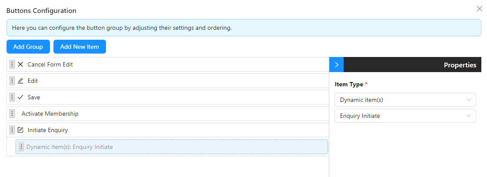
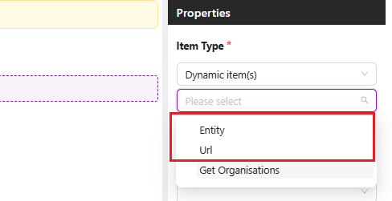
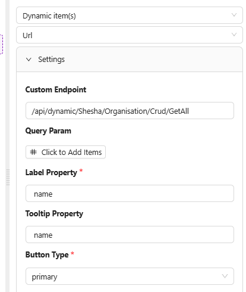
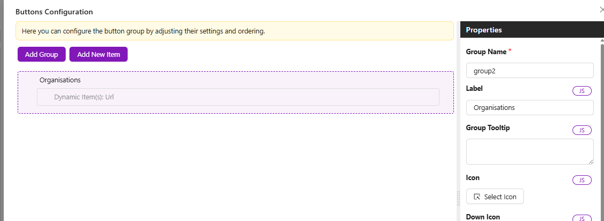
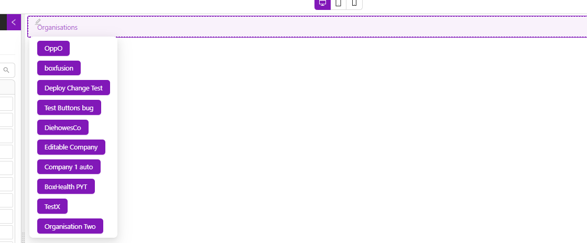
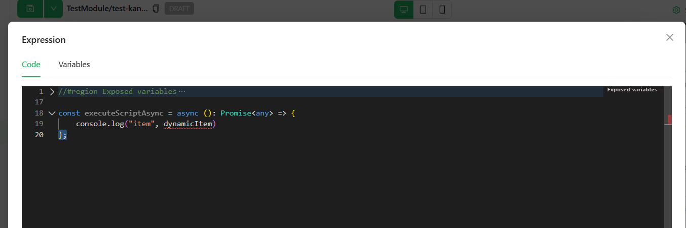

# Dynamic Menu Items

Dynamic menu items refer to the ability to generate or modify menu items in a user interface (UI) dynamically based on certain conditions or data. This is often implemented in web applications to create menus that change based on factors such as user roles, permissions, user preferences, or the current state of the application.

Here's an explanation of dynamic menu items:

1. **Generating Menu Items Programmatically:** Instead of hardcoding menu items directly into the UI code, dynamic menus are generated programmatically based on certain criteria. For example, menu items can be generated based on the user's role or permissions.

2. **Role-Based Menus:** Dynamic menu items can be tailored to specific user roles. For instance, an admin user might see additional menu options compared to a regular user.

3. **Permission-Based Menus:** Menu items can be displayed or hidden based on the user's permissions. For example, if a user doesn't have permission to access a certain feature, the corresponding menu item for that feature might not be displayed to them.

4. **User Preferences:** Users may have the ability to customize their menus based on their preferences. This could involve rearranging menu items, adding shortcuts, or hiding certain options.

5. **Data-Driven Menus:** Dynamic menus can also be driven by data retrieved from a database or an external API. For example, a menu might be populated with items retrieved from a list of categories stored in a database.

6. **Contextual Menus:** Menu items can change dynamically based on the current context or state of the application. For instance, certain options might be available only when a specific action is performed or when certain conditions are met.

7. **Real-Time Updates:** In some cases, dynamic menus may update in real-time without requiring a page reload. This could be useful for applications where the menu needs to adapt to changes made by other users or changes in the application state.

Dynamic menu items provide flexibility and customization options in UI design, allowing applications to adapt to various user needs and scenarios. They enhance usability by presenting users with relevant options based on their context and permissions, leading to a more intuitive and efficient user experience.

Dependencies: `swr` - Install by running `npm i swr@2.1.5` on the root directory.

In the directory `adminportal\src\components\templates`, create the following files:

- `model.ts`

```javascript
export interface TemplateDefinition {
  id: string;
  name: string;
}

export interface Template {
  items: TemplateDefinition[];
}
```

- `fetchers.ts`

```javascript
export const URLS = {
  GET_ALL_TEMPLATES: `/api/dynamic/Shesha.Tutorial/Template/GetAll`,
};

export function GetMember() {
  const queryString = window.location.search;
  const urlParams = new URLSearchParams(queryString);
  return urlParams.get("id");
}
```

- `hooks.ts`

```javascript
import { IAjaxResponse, useSheshaApplication } from "@shesha-io/reactjs";
import { Template, TemplateDefinition } from "./model";
import axios from "axios";
import { URLS } from "./fetchers";
import useSWR from "swr";

export const useTemplates = () => {
  const { backendUrl, httpHeaders } = useSheshaApplication();

  const fetcher = () => {
    return (
      axios.get <
      IAjaxResponse <
      Template >>
        (URLS.GET_ALL_TEMPLATES,
        {
          baseURL: backendUrl,
          headers: httpHeaders,
        }).then((res) => {
          const result = res.data.result;

          return result.items;
        })
    );
  };

  return useSWR([URLS.GET_ALL_TEMPLATES, httpHeaders], fetcher, {
    refreshInterval: 0,
    revalidateOnFocus: false,
  });
};
```

2. In this directory, `\adminportal\utils`, create a `configurableActions.ts` file with the following:

```javascript
import {
  IConfigurableActionConfiguration,
  INavigateActoinArguments,
} from "@shesha-io/reactjs";

const ACTION_CONFIG_TYPE = "action-config";

export const makeActionConfig = <TArgs = any>(
  props: Pick<
    IConfigurableActionConfiguration<TArgs>,
    "actionName" | "actionOwner" | "actionArguments" | "onSuccess" | "onFail"
  >
): IConfigurableActionConfiguration<TArgs> => {
  return {
    _type: ACTION_CONFIG_TYPE,
    actionName: props.actionName,
    actionOwner: props.actionOwner,
    actionArguments: props.actionArguments,
    handleSuccess: Boolean(props.onSuccess),
    onSuccess: props.onSuccess,
    handleFail: Boolean(props.onFail),
    onFail: props.onFail,
  };
};

export const makeNavigateActionConfig = (
  props: Pick<
    IConfigurableActionConfiguration<INavigateActoinArguments>,
    "actionArguments" | "onSuccess" | "onFail"
  >
): IConfigurableActionConfiguration<INavigateActoinArguments> => {
  return {
    _type: ACTION_CONFIG_TYPE,
    actionName: "Navigate",
    actionOwner: "shesha.common",
    actionArguments: props.actionArguments,
    handleSuccess: Boolean(props.onSuccess),
    onSuccess: props.onSuccess,
    handleFail: Boolean(props.onFail),
    onFail: props.onFail,
    version: 2,
  };
};
```

3. Create a provider for evaluation of actions list. In this example we build a list of templates which are used to choose the ‘Enquiry Types’:

In this directory, `adminportal\src\components\templates\dynamic-templates`, create an `enquiry-initiate.tsx` file with the following:

```javascript
import React, { PropsWithChildren, useMemo } from "react";
import { FC } from "react";
import {
    DynamicActionsProvider,
    ButtonGroupItemProps,
    DynamicItemsEvaluationHook,
    useAppConfigurator,
    IButtonItem,
} from "@shesha-io/reactjs";
import { useTemplates } from "../hooks";
import {
    makeActionConfig,
    makeNavigateActionConfig,
} from "utils/configurableActions";
import { GetMember } from "../fetchers";

export interface IWorkflowInstanceStartActionsProps { }

const useEnquiryInitiateActions: DynamicItemsEvaluationHook = (args) => {
    // Calling hook to get all templates
    const { data, isLoading, error } = useTemplates();
    const { configurationItemMode } = useAppConfigurator();

    const operations = useMemo<ButtonGroupItemProps[]>(() => {
        if (!data || isLoading || error) return [];

        // Mapping out templates to form list of options
        // Dependencies: current user
        const result = data.map<IButtonItem>((p) => ({
            id: p.id,
            name: p.name,
            label: p.name,
            itemType: "item",
            itemSubType: "button",
            sortOrder: 0,
            actionConfiguration: makeActionConfig({ // Creating Enquiry from selecting a template
                actionName: "API Call",
                actionOwner: "shesha.common",
                actionArguments: {
                    verb: "post",
                    url: `/api/dynamic/Shesha.Tutorial/Enquiry/Create`,
                    parameters: [
                        {
                            id: "CBc2Xng3M682kZwGhAwHt",
                            key: "member",
                            value: GetMember(),
                        },
                        {
                            id: "AKc2Xng3M682kZwGhAwHt",
                            key: "template",
                            value: p.id,
                        }
                    ],
                    sendStandardHeaders: true,
                },
                onSuccess: makeNavigateActionConfig({ // Navigating to Enquiry Form
                    actionArguments: {
                        navigationType: "url",
                        url: "/dynamic/ShaCompanyName.ShaProjectName/member-enquiry",
                        queryParameters: [{ key: "id", value: "{{actionResponse.id}}" }, { key: "mode", value: "edit" }],
                    },
                }),
                onFail: makeActionConfig({ // Error message to show on fail
                    actionName: "Show Confirmation Dialog",
                    actionOwner: "shesha.common",
                    actionArguments: {
                        title: "Error",
                        content: "Failed to initiate enquiry!",
                        okText: "",
                        cancelText: "",
                    },
                }),
            }),
        }));

        return result;
    }, [args.item, data, configurationItemMode]);

    return operations;
};

export const EnquiryInitiateActions: FC<
    PropsWithChildren<IWorkflowInstanceStartActionsProps>
> = ({ children }) => {
    return (
        <DynamicActionsProvider
            id="enquiry-initiate"
            name="Enquiry Initiate"
            useEvaluator={useEnquiryInitiateActions}
        >
            {children}
        </DynamicActionsProvider>
    );
};

```

3.1. In the same directory, create an `index.tsx` file to initialize your provider, also making provision for other providers of the same scope to be combined:

```javascript
import React, { FC, PropsWithChildren } from "react";
import { EnquiryInitiateActions } from "./enquiry-initiate";

export interface IEnquiryActionsProviderProps {}

export const EnquiryActionsProvider: FC<
  PropsWithChildren<IEnquiryActionsProviderProps>
> = ({ children }) => {
  return <EnquiryInitiateActions>{children}</EnquiryInitiateActions>;
};
```

4. Render your provider under the main application provider, `\adminportal\src\app\app-provider.tsx`, see below:

```javascript
"use client";

import React, { FC, PropsWithChildren } from "react";
import {
  GlobalStateProvider,
  ShaApplicationProvider,
  StoredFilesProvider,
  MainLayout,
  useNextRouter,
} from "@shesha-io/reactjs";
import { AppProgressBar } from "next-nprogress-bar";
import { useTheme } from "antd-style";
import { EnquiryActionsProvider } from "@/components/templates/dynamic-templates";
/* NEW_TOOLBOXCOMPONENT_IMPORT_GOES_HERE */

export interface IAppProviderProps {
  backendUrl: string;
}

export const AppProvider: FC<PropsWithChildren<IAppProviderProps>> = ({
  children,
  backendUrl,
}) => {
  const nextRouter = useNextRouter();
  const theme = useTheme();

  const noAuthRoutes = [
    "/no-auth",
    "/login",
    "/account/forgot-password",
    "/account/reset-password",
  ];
  const noAuth = Boolean(
    noAuthRoutes.find((r) => nextRouter.path?.includes(r))
  );

  return (
    <GlobalStateProvider>
      <AppProgressBar height="4px" color={theme.colorPrimary} shallowRouting />
      <ShaApplicationProvider
        backendUrl={backendUrl}
        router={nextRouter}
        noAuth={false}
        toolboxComponentGroups={
          [
            /* NEW_TOOLBOXCOMPONENT_GOES_HERE */
          ]
        }
      >
        <EnquiryActionsProvider>
          <StoredFilesProvider baseUrl={backendUrl} ownerId={""} ownerType={""}>
            {noAuth ? (
              <>{children}</>
            ) : (
              <MainLayout noPadding>{children}</MainLayout>
            )}
          </StoredFilesProvider>
        </EnquiryActionsProvider>
      </ShaApplicationProvider>
    </GlobalStateProvider>
  );
};
```

5. Use `Item Type` = `Dynamic item(s)` on the button group configurator to add your items. See below image:
   
   

Once a template has been selected, the user will be redirected to the `member-enquiry` form which is initialized with a different form based on which template was selected:

**1. Renewal**


**2. Assistance**


**3. Cancellation**


**4. Feedback**


## Alternative Approach 

You can also configure your dynamic menu items, this approach requires no code.

**Step 1** - Drag in your button or button group, add an item and select `Dynamic item(s)` as the Item type.


**Step 2** - From the options, select either:

 - `URL`: Fetch data from a custom endpoint.
 - `Entity`: Fetch data from a specified entity with filters.
 
 

**Step 3** - Depending on which method you chose, you can fill in the settings. for example:

  If `URL` is chosen:
  - Specify the custom endpoint to fetch data from.
  - Define query parameters for the request, e.g., maxResultCount.
  - Set the button type to define its style.

  

  - You can now view your buttons:

  

  - You can also display them in a group, this allows the buttons to be displayed in a dropdown format.

  

  

  - Configure actions for the buttons, e.g., navigate to a form dynamically based on the data from the clicked button.
  - To access metadata from the clicked button, log `dynamicItem`

  

  

  If `ENTITY` is chosen:
  - Specify the entity type.
  - Specify the `maxResultCount` of your data.
  - You can also include filters on your data. e.g.

  
  - Configure actions for the buttons, e.g., navigate to a form dynamically based on the data from the clicked button.
