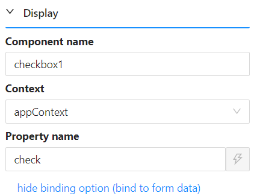

# App Context

This context object is often used to store settings, configuration, or data that needs to be shared across different parts of the application.

:::info
Contexts allow to have several storages for the application and use additional layers of form configuration. For example, you can use checkbox/button to switch count of fields, required fields, visibility/enabled. Or use length of text to show warnings.
:::

**Data Entry:**
This takes in all the properties that have a [property name](/docs/front-end-basics/form-components/common-component-properties#property-name), or [context](http://localhost:3000/docs/front-end-basics/form-components/common-component-properties#context) property set to `appContext`.



This is how you would tap into the `check` value of the Checkbox component that has been added in the `appContext`

```
	contexts.appContext.checkl
```
