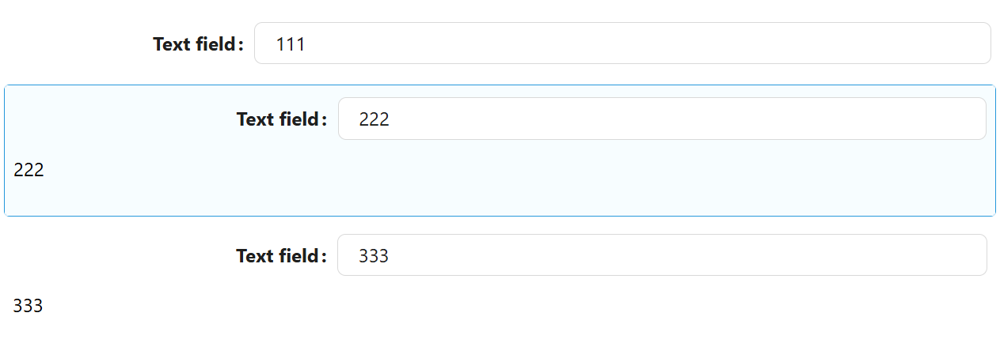

# Form context

Context for storing temporary data for form.

Accessed via `contexts.formContext`  

`formContext` provides access to form level data context. All the data stored in this context is available inside the specific form (Subforms, Modal dialogs, Form cells, Data list items, etc.). It can be used to save any temporary data used on the form. When closing a form, all the form context data is cleared.

## How to use

To save data in the context of any of these types, it is enough to specify a variable name and assign a value to it.

Setting a value

```Javascript
contexts.formContext.myFormAvailable = 'test data`;
```

To use data from the context of any of these types, it is also enough to use the variable name.

Reading a value 

```Javascript
const getPlaceHolder = () => {
	return contexts.formContext.myFormAvailable;
}
```

## The specifics of form contexts

Please note that one `appContext` and one `pageContext` are always available for use. However, there may be multiple `formContext`. For example, if two SubForms are used on a main form, then the main form has its own `formContext`, and each subform has its own `formContext`. The components on each of the forms (SubForms) will only have access to the `formContext` of their form.

### Example

There is a Form with TextField and Text components.

The TextField component bound to the `formContext` and `test` Property name.


The Text component has scripted Content setting


So, the Text component shows values typed in the TextField component.

Then this Form is used as a SubForm.

Main form contains TextField component (also bound to the `formContext` and `test` Property name) and two SubForm. So, it means that all TextField components are bound to the `formContext` and `test` Property name. But as can you see each TextField component is bound to its own `formContext`, and their values are not mixed


