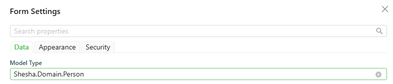

# Form Instance API

The `form` object gives your scripts access to the current form: its data, its mode, and the functions to read or update field values, submit, and report validation errors. It's available in every script alongside the other standard script variables.

---

## Reading Form State

#### **form.data** `object`

Provides access to the form data. This is the same object as the top-level `data` variable.

```typescript
const formData = form.data;
```

#### **form.formMode** `string`

Returns the current form mode. It is one of:

- `edit`
- `readonly`
- `designer`

#### **form.formSettings** `object`

Gives access to the form's own configuration, currently exposing only `modelType` - the entity type the form is bound to, if any.

```typescript
console.log(form.formSettings);
```

#### **form.defaultApiEndpoints** `object`

The default CRUD API endpoints (`create`, `read`, `update`, `delete`, `list`), available only when the form's `Model type` is an existing entity.



```typescript
console.log(form.defaultApiEndpoints);
```

which logs:

```json
{
  "read": {
    "httpVerb": "GET",
    "url": "api/dynamic/Shesha/Person/Crud/Get"
  },
  "list": {
    "httpVerb": "GET",
    "url": "api/dynamic/Shesha/Person/Crud/GetAll"
  },
  "create": {
    "httpVerb": "POST",
    "url": "api/dynamic/Shesha/Person/Crud/Create"
  },
  "update": {
    "httpVerb": "PUT",
    "url": "api/dynamic/Shesha/Person/Crud/Update"
  },
  "delete": {
    "httpVerb": "DELETE",
    "url": "api/dynamic/Shesha/Person/Crud/Delete"
  }
}
```

#### **form.initialValues** `object`

The values the form had when it first loaded, before any user edits.

#### **form.parentFormValues** `object`

The field values of the parent form, if this form is being rendered inside a SubForm.

#### **form.formArguments** `object`

The arguments passed to the form by whatever opened it (for example, query parameters or values passed when navigating to the form).

---

## Updating Form Data

#### **form.setFieldValue(name, value)** `function`

Sets a single field's value by name.

```typescript
form.setFieldValue('firstName', 'Jane');
```

#### **form.setFieldsValue(values)** `function`

Merges an object of field values into the form's current data.

```typescript
form.setFieldsValue({ firstName: 'Jane', lastName: 'Doe' });
```

#### **form.clearFieldsValue()** `function`

Clears all field values on the form.

```typescript
form.clearFieldsValue();
```

#### **form.addDelayedUpdateData(data)** `function`

Adds data to the form's deferred-update queue, returning the current list of pending delayed updates.

```typescript
form.addDelayedUpdateData(data: any) => IDelayedUpdateGroup[]
```

:::warning form.setFormData is deprecated
`form.setFormData(payload)` is `@deprecated` and should not be used. Use `form.setFieldValue`/`form.setFieldsValue` instead.
:::

---

## Submitting and Reporting Validation

#### **form.submit()** `function`

Submits the form, the same as clicking its Submit button.

```typescript
form.submit();
```

#### **form.setValidationErrors(payload)** `function`

Sets the validation errors shown by a [Validation Errors](/docs/front-end-basics/form-components/data-display/validation-errors) component on the form. Accepts a string, an `IErrorInfo` object, an `IAjaxResponseBase` API error response, an Axios response wrapping one, or an `Error`.

```typescript
form.setValidationErrors('Something went wrong while saving.');
```

#### **form.getFormData()** `function`

Returns the form's current data. Use this in places where you need the freshest data rather than a value captured in a closure.

```typescript
const currentData = form.getFormData();
```

---

## Advanced

#### **form.formInstance** `object`

The underlying Ant Design form instance that renders the form. See the [Ant Design Form documentation](https://ant.design/components/form) for its full API.

#### **form.shaForm** `object`

The internal Shesha form instance. Prefer the methods and properties above for everyday scripting - this is an advanced escape hatch into Shesha's own form machinery.
