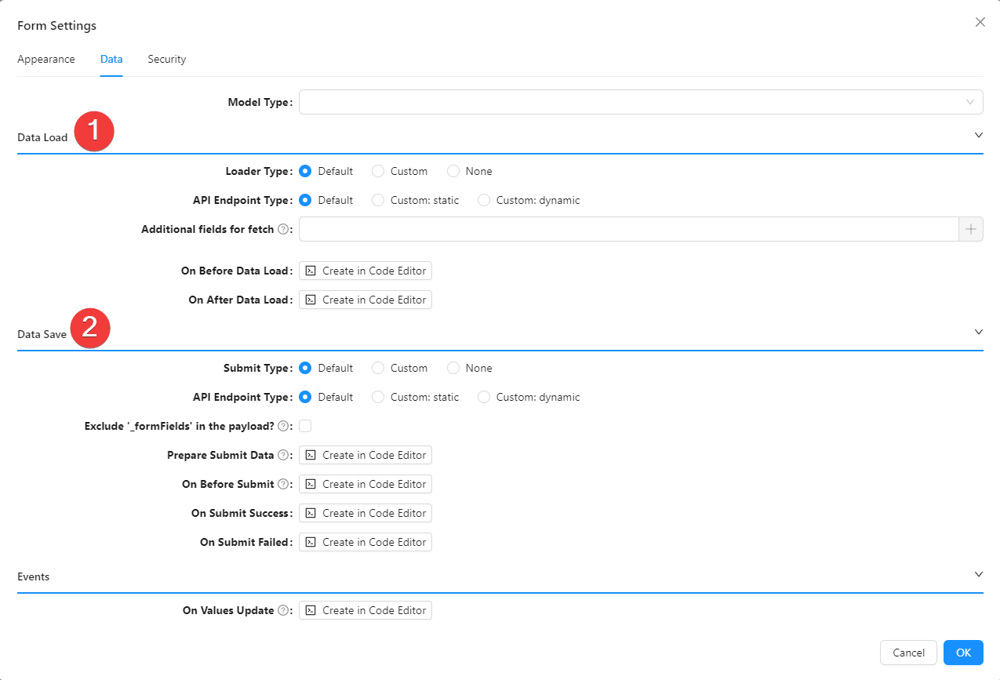
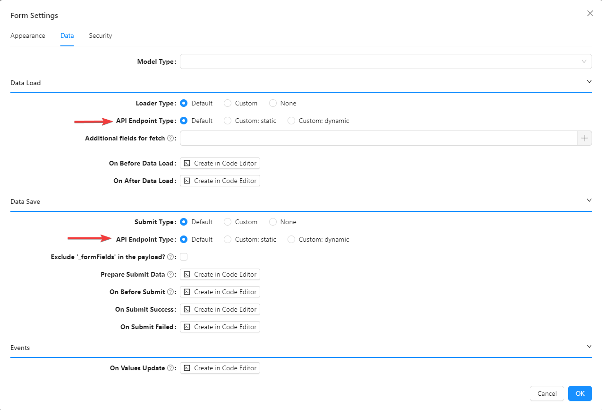

# Configurable Form Lifecycle

You can define how a form behaves at different stages using Configurable Form lifecycle.

### Current Form Settings

Form settings as they are now, mainly contain 3 groups;
1.	**Appearance**: This contains all settings related to form view like layout and size.
2.	**Data**: This contains settings related to data processing and the form lifecycle.
3.	**Security**: These are general security related settings.

When it comes to form settings, the Data group is the most important one and has been reviewed after the Shesha 0.37 release.



We'll take a closer look at the two(2) sections within the Data Group.

### 1. Data Load
The data load section configures the logic of data loading.

#### Loader Type


The loader type of a form specifies the type data loader used.
Primarily, there are 3 available loader types;
1.	**Default**: This is applicable for entities. It loads data using the standard Shesha CRUD application services with GraphQL support. There are also some Nested settings for this type, which are visible only when this particular loader is selected, which are;
- ***API Endpoint Type***: This specifies the endpoint type used. The values available for API Endpoint type specification are;
    - ***Default***: This uses the default Get API endpoint for the specified entity type.
    - ***Custom (Static)***: This allows specifying the URL manually. (*NB: Currently only **GET** verb is supported*)
    - ***Custom (Dynamic)***: This allows specifying the URL dynamically using a JavaScript expression. (*NB: The expression must return an instance of [IApiEndPoint](#api-endpoints)*)
2.	**Custom**: This loads data using custom JavaScript.
3.	**None**: This particular configuration is used when a form shouldn’t load any data. For instance, when a form is used to create an entity.

#### On Before Data Load 


This event handler fires before the data loading (applicable for all data loaders). This can be used for contexts initialization or debug purposes. 
It runs asynchronously as the form waits for completion of this handler before processing of other lifecycle steps. 


#### On After Data Load


This event handler fires after the data loading (applicable for all data loaders). Here you can override loaded data or initialize some contexts. 
It also runs asynchronously as the form waits for completion of this handler before processing of other lifecycle steps. 


### 2. Data Save
This section configures to logic of data submission.

#### Submit Type 


Below is a breakdown of the different submit types;

1.	**Default**:  This is applicable for entities. It submits the data using standard Shesha CRUD application services with GraphQL support. There are a few nested settings the default type can have, namely;
    -   ***API Endpoint Type***: This specifies the endpoint type used. The values available for API Endpoint type specification are;
        - ***Default***: This uses the default PUT endpoint if the data contains an Id property and the default POST Api endpoint when Id is missing.
        - ***Custom (Static)***: This allows specifying the http verb and URL manually.
        - ***Custom (Dynamic)***:  This allows specifying the URL dynamically using JavaScript expression. (*NB: The expression must return an instance of [IApiEndPoint](#api-endpoints)*)

        *Keep in mind that explicit usage of API endpoints is a more flexible solution and it allows to configure forms for custom operations, like a deletion confirmation form with reason/comments*. 
    -   ***Exclude _formFields in the payload***: The **_formFields** is a service field that is used for partial updates, in some cases can be switched it off. (*NB: This functionality may be reviewed in the next major release*)
2.	**Custom**: This submits the data using custom JavaScript.
3.	**None**: This is used when a form shouldn’t submit any data. For instance, when form is used only to display some data. **i.e.** Prepare Submit Data.

The Submit handler transforms the data that should be submitted. If the handler is specified, it should return the full data to be submitted as forms don’t merge/modify the data return by this handler.

#### On Before Submit 


This runs before the data submission.

####  On Submit Success 


This runs after successful data submission.

####  On Submit Failed 


This runs on data submission error. 

### API Endpoints 

The current Shesha version now uses API endpoints. In contrast to the legacy version which used URL for CRUD operations. API endpoint definition is an object that contains http verb  and URL.

By Default, the API endpoint type definition looks like this;

``` ts
export interface IApiEndpoint { 
  /** 
   * Http verb (get/post/put etc) 
   */ 
  httpVerb: string; 
  /** 
   * Url 
   */ 
  url: string; 
} 
```



Also, the Shesha public JavaScript API has been extended with new functions which allow to simplify operations with default endpoints, let’s run through them;

-   The **defaultApiEndpoints** property added to the form instance. It contains default CRUD endpoints of the current entity type specified on the form settings. See below Code example: 
``` ts
const getSubmitterEndpoint = async () => { 
    return data?.id  
        ? form.defaultApiEndpoints.update  
        : form.defaultApiEndpoints.create 
}; 
```   

-   The **getApiEndpointsAsync()** method added to the entities, it allows to get CRUD endpoints of the specified entity type. Here’s an example: 
``` ts
const getSubmitterEndpoint = async () => { 
    const defaultEndpoints = await application.entities.shesha.Person.getApiEndpointsAsync(); 
    return data?.id  
        ? defaultEndpoints.update  
        : defaultEndpoints.create 
}; 
```

### Form arguments 

Shesha Configurable Forms support explicit arguments. It is an object if any structure that can be passed to the form caller. There are two main use-cases of Configurable Form usage;
-	Configurable Form rendered on the dynamic page. In this case form arguments contain a query string of the current URL. 
-	Configurable Form rendered on the modal dialog. **Arguments** can be passed as a JavaScript object explicitly using Arguments setting of the **Common: Show Modal action**. This setting is a replacement of the legacy **Additional properties** setting, which was migrated automatically.

### Migration of legacy settings
Legacy form settings have been updated automatically by migration; it covers most of the use-cases but in some cases, it may require manual correction. 


Here’s a detailed breakdown of the migration process: 

1.	**Initial values** has been converted to JavaScript expression as part of **[onAfterDataLoad](#on-after-data-load)** event. 
2.	**Prepared Values** has been converted to new **Prepare Submit Data**; the code updated automatically to follow the new logic. Migrated code executes old event and merges it into the form data. 
3.	**On Initialized** has been converted to new **[On Before Data Load](#on-before-data-load)** event.
4.	**On Data Loaded** has been converted to **[On After Data Load](#on-after-data-load)**. 
5.	**On Update** has been renamed to **On Values Update**. 
6.	**Advanced settings** all custom CRUD URLs were converted to a group of new settings under **Data Load/Data Save**.
    - **Custom Read URL** has been converted to **Data Load: API Endpoint Type** and **Endpoint** settings.
    - **Custom Create/Update/Delete URLs** have been converted to **Data Submit: API Endpoint Type** and **Endpoint** settings.
    - **Configurable Form Lifecycle**.


