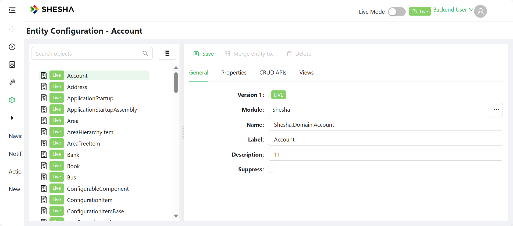
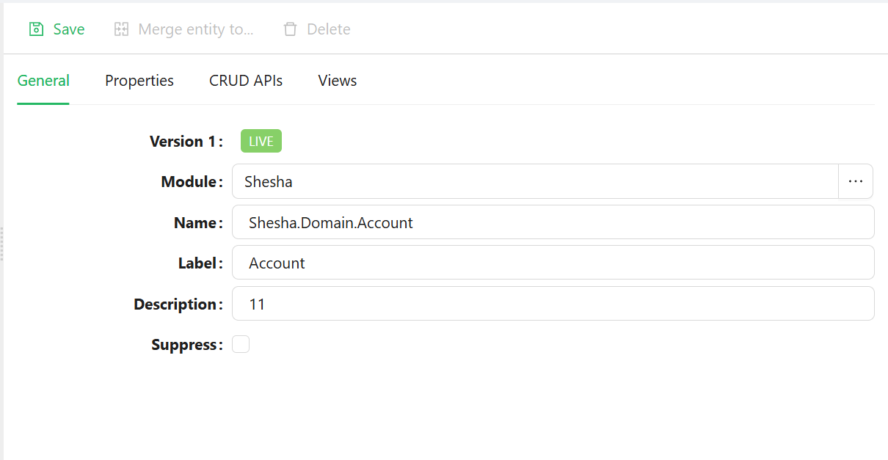
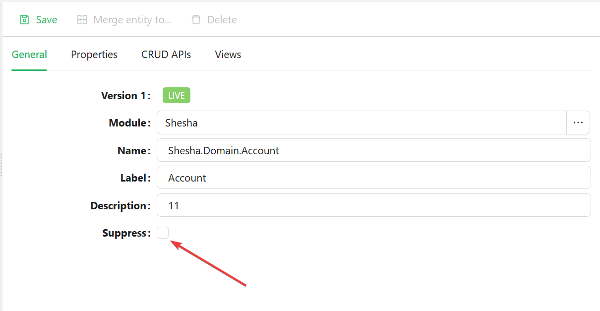
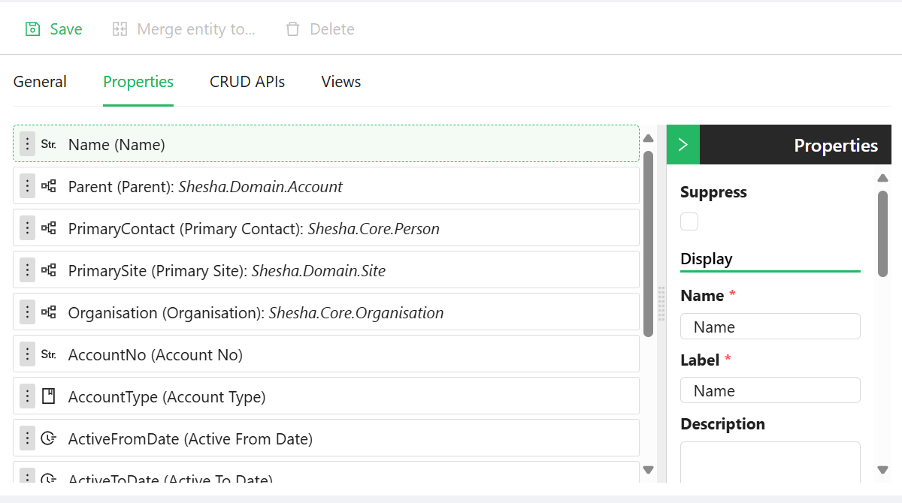

# Entity Configuration

The **Entity Configuration** lists all entities within the system, providing extensive access and flexibility to update entities directly from the frontend without requiring code changes. These configurations are considered **configurable items**, meaning they can be **exported** and **imported** via the **Forms View**.

It includes both **Dynamic Entities** and **JsonEntities**, with a dropdown that allows users to filter and view entities based on predefined grouping options.

### General

- Displays **basic information** related to the entity.
- **Suppress**: Removes the entity from the list.

### Properties

This tab lists all properties related to the entity and allows for quick configuration without developer intervention. Users can:
- Set fields as **Required**, **ReadOnly**, or **Audited**.
- Configure cascading behavior for **Create**, **Update**, and **Delete** actions for unreferenced entities.
- Modify **date formats** and **number formats** based on the data type of the property.

### CRUD APIs

- TODO

### Views

Supports **dynamic rendering** of subforms. Users can define **views** for an entity, ensuring that components call the correct form configuration upon rendering.

**Example**:
If a subform is bound to the **Address** entity and is rendered within the **Person** entity, and the subform is configured to dynamically call the **QuickView** of **Address**, then upon render:
        1. The subform checks the **ClassName** and **View Type**.
        2. It retrieves and applies the configured form accordingly.

