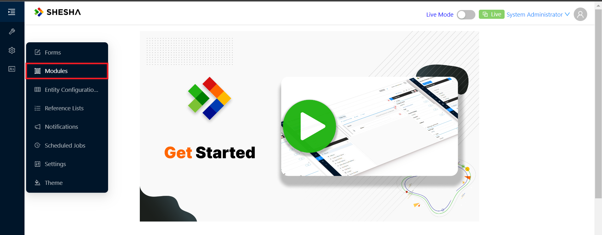
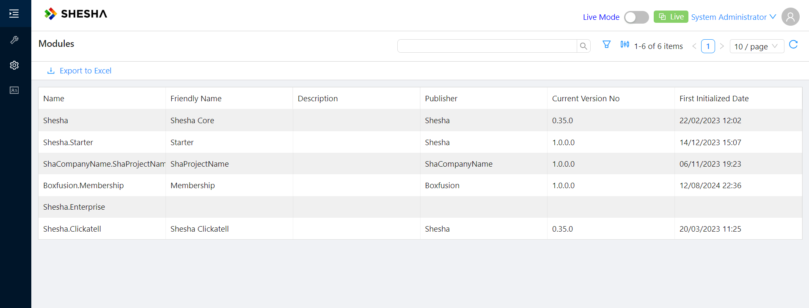

# Modules

Shesha promotes a modular approach to application development. It encourages packaging reusable functionality as Shesha modules for easy future reuse. Instead of building from scratch, Shesha allows assembling pre-existing modules to implement solutions efficiently. Shesha modules are distributed as regular NuGet packages and implement the `SheshaModule` class.

Shesha's modularization approach builds on top of the [ASP.NET Boilerplate module system](https://aspnetboilerplate.com/Pages/Documents/Module-System) to leverage its initialization, dependency, and plug-in management capabilities.

Additionally, Shesha enables embedding and distributing configuration information, such as form configurations, and initializing key module parameters during application startup.

A Shesha module can include various components, such as a domain model, services, APIs, form configurations, reference lists, and other NuGet-like artifacts.

If the module relies on custom front-end components and pages, the NuGet installation should be accompanied by a corresponding NPM package containing the required front-end components.

## View installed modules

To view the modules installed in the application, navigate to the Admin portal and select the Modules menu item.



You should then see the list of installed modules



## Create a new module

### Add the SheshaModule class

Creating a new module in Shesha is a straightforward process. It involves creating a new class library project and implementing the `SheshaModule` class. A Shesha module can be composed of one or more ASP.NET Boilerplate modules and assemblies. The decision to make an assembly a Shesha module depends on whether you need the ability to associate configuration to it for easy distribution. If configuration distribution is not required, the assembly can be a regular ASP.NET Boilerplate module.

:::tip ASP.NET Boilerplate module system
It is recommended to familiarize yourself with the basics of the ASP.NET Boilerplate module system by referring to the [documentation](https://aspnetboilerplate.com/Pages/Documents/Module-System).
:::

A typical Shesha module class is shown below:

```cs
[DependsOn(
    typeof(CrmDomainModule),
    typeof(SheshaCoreModule),
    typeof(AbpAspNetCoreModule)
)]
public class CrmApplicationModule : SheshaModule
{
    public override SheshaModuleInfo ModuleInfo => new SheshaModuleInfo("Crm") {
        Name = "Customer Relationship Management",
        FriendlyName = "Module help manage customer relationships and interactions.",
        Publisher = "AcmeCorp"
    };

    public override async Task<bool> InitializeConfigurationAsync()
    {
        // Import any configuration embeded as resources in this assembly on application start-up.
        return await ImportConfigurationAsync();
    }

    public override void Initialize()
    {
        var thisAssembly = Assembly.GetExecutingAssembly();

        // Register IoC services
        IocManager.RegisterAssemblyByConvention(thisAssembly);

        // Scan the assembly for classes which inherit from AutoMapper.Profile
        Configuration.Modules.AbpAutoMapper().Configurators.Add(
            cfg => cfg.AddMaps(thisAssembly)
        );
    }


    public override void PreInitialize()
    {
        var thisAssembly = Assembly.GetExecutingAssembly();

        // Create Controllers for all AppServices classes in the assembly
        Configuration.Modules.AbpAspNetCore().CreateControllersForAppServices(
            typeof(SheshaFormsDesignerModule).Assembly,
            moduleName: "Crm",      // Specifies the module name to use for the controller route
            useConventionalHttpVerbs: true);
    }
}
```

Options available for the `SheshaModuleInfo` class are shown below:

| Name               | Description                                                                                                                       |
| ------------------ | --------------------------------------------------------------------------------------------------------------------------------- |
| Name               | This is globally unique name which will follow similar convention as .NET Namespaces e.g. `MyOrg.MyModuleName`                    |
| FriendlyName       | This is a short user friendly name e.g. 'My Module Name'                                                                          |
| Description        | More details on the module                                                                                                        |
| Publisher          | Name of the Publisher (Typically your organisation name).                                                                         |
| VersionNo          | Version number. This property is used for manual versioning, for automatical versioning you can use `UseAssemblyVersion` property |
| UseAssemblyVersion | If true, indicates that the module version is equal to the assembly file version                                                  |

### Specify the database prefix

If your module also contains domain classes, you should also specify the [database prefix](/docs/back-end-basics/domain-model#module-database-prefix) by adding the following lines to the `AssemblyInfo.cs` file.

```csharp title="/Properties/AssemblyInfo.cs"
...
// Shesha specific attributes
// highlight-start
// Specifying the prefix to use for database objects belonging to this project
[assembly: TablePrefix("Crm_")]
// highlight-end
...
```

### Embed configuration

To embed configuration in the module, to be distributed automatically during application startup refer to the [configuration distribution documentation](configuration).

## Install a module

To install a module, follow these steps:

1. Install the module as you would any regular NuGet package.
2. If the module has dependencies on custom front-end components, you will also need to install the corresponding NPM package(s) on the front-end.
3. Any configuration embedded in the module will be automatically imported during application startup. For more information on how this works, refer to the configuration distribution documentation.
4. Update the module classes of any project depending on the newly added module to include the new module in the `DependsOn` attribute. This ensures that the module is loaded and initialized when the application starts. See the example below:

```cs
[DependsOn(
// highlight-start
    typeof(SomeUsefulModule),
// highlight-end
    typeof(SheshaCoreModule),
    typeof(AbpAspNetCoreModule)
)]
public class CrmApplicationModule : SheshaModule
{
    ...
}
```

## See also

- [ASP.NET Boilerplate module system](https://aspnetboilerplate.com/Pages/Documents/Module-System)
- [Shesha Configurations and how to distribute them](configuration)
