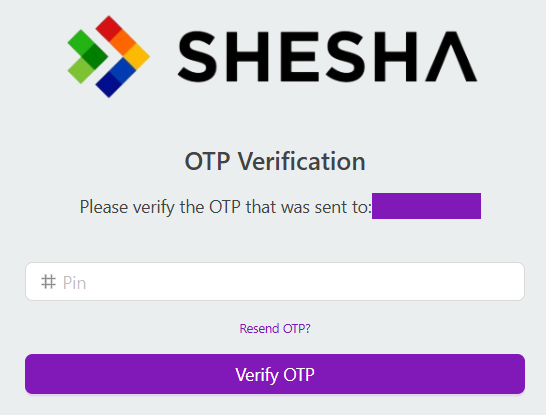
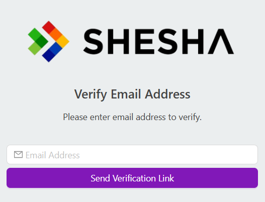

# User Registration

This system provides a flexible way for users to create accounts on your platform. Think of it as a `customizable welcome desk` where you can choose exactly how you want your users to sign up. You can let them register using their email, phone number, and in the future, even their existing accounts from services like Google or Facebook.

The system is designed to be user-friendly while maintaining security. You can choose what information to collect from users and customize the registration process to match your needs. For example, you might want to collect just basic information like name and email, or you might need additional details specific to your organization.

:::caution Rework Required
TODO: Need to be updated to more clearly indicate how to configurate the user registration process. Possible updates include:
- Explain that there are two main methods for user registration:
  - **Self-registration**: Users can create their own accounts. Optional.
  - **Admin registration**: Administrators create accounts for users. Reference /docs/for-administrators/user-management.md
- Intro needs to be reworked to provide a clearer overview of the user registration process and customisation options available:
  - Remove self-registration option
  - Customising the registration form
- Mermaid diagram is overly complex and can be removed
- Screenshot of the registration settings
- How to update the registration form
- Registration of custom Person entity
:::

## Key Features

- Multiple ways to sign up (email, phone, or through other services)
- Simple and secure verification process
- Flexible information collection
- Smooth transition from registration to using your service

## Configuration Options

### Supported Registration Method

The system allows selection of exactly one registration method through configuration. Only one method can be active at a time, and this setting determines how users will register on your platform.

#### Available options:

1. **None**
    - Selection of this option completely disables new user registration.
    - The Register link will be hidden from the login page

> _**NOTE**: With the below options, the register link will show on the login page and will require input of chosen method to validate details

 

2. **Email**
    - Users register using their email address
    - Email verification is mandatory (this is done through usage of an `OTP` or a `verification link`)

3. **SMS**
    - Users register using their mobile phone number
    - Mobile verification is mandatory through `OTP`
 

### Require Email Verification

The system automatically sends a verification email containing a secure verification link, which:
1. Contains unique token
2. Has expiration time
3. Single-use only

 

### User Email as Username

The `UserEmailAsUsername` setting determines whether the system uses the user's `email address` as their `username` for authentication purposes. 
- When **false**: Enables separate username field
- Enforces username uniqueness checks
- When **true**: Uses email as username

### Go to URL After Registration

- Defines the URL to which the user will be redirected after successful registration. This ensures a seamless transition to the next step in the user journey.

### Additional Registration Information

Defines a form for capturing extra details beyond basic user information. If enabled, the user must complete this form before completing the registration process.
> _**NOTE**: If this option is selected then the registration process will be placed on draft until the form information has been completed and an additional endpoint (**`/api/services/app/UserManagement/CompleteRegistration`**) to finalize the registration has been actioned.
> **If this has not been actioned then the user will be redirected to complete the `Additional Registration Information` form upon login.**

## Process Flow

[](https://mermaid.live/edit#pako:eNqtVF1T4jAU_St38owOhVG0DzujIIoCIl_ObuEhtgEytgmbprpuy3_fm6QoHfVteeiQ3HPuufckNzkJZcSIT9aKbjcw7SwE4O8i6EsaQV-uuYCuVMkSjo5-wGXe3rDwGVKmNRfrFFZSQZptt1JpFoFia55qRTWXAhKmNzLauXyXhl4M7BZMWMxCxBfQDiYb-QrjQ16fi-elY7WtaCd3BHB0H-6nI0Ddq4TyGOZM8RUPLbcUc9-OlTRYxyvgyqmZrUmoGBOlzJWV6aKMiGxUSxjIJx6zd5kyc9e1YWMFXAdfMIZZ8sTU8hBvMxRwU4G76i-iSLE0LeHXtpBeMEuZAiY0U-m-WcV-ZyzVKVAh9QbDo96wZN04llv07OI2mNOYR1Qzwy9xt7aYMmCcnmRhiOIF3AVD-sLXBo6VVU5jRNds-dnWz94X0Hf2upA5xUq8annfljlwjlRglvjCqctTwgcWPvzoyokgfMwirvByILVS5vC_NHtnde8rB1Jh9AROQEIP5O8tZZR_B9sXssr2l2pkS_3JsLaHHC8ENzAafytUoQ1lAePghooI716F0UWHMlXt58FyPuZvUvHiQPuwYDv-h_yh1AczPA2upWHPxn2gK7SoUkZFfmK9mQUmI7Rlso0ZpighMxucB_v9r9LMLWb6qSV4zG3Ongj3bOv0U2rGRmj3kJXGPdom9hfHlP4uaZKgKwtBaiRhaACP8GnMDW9BcOwStiA-_o3YimaxXpCF2CGUZlpO3kRIfK0yViNKZusN8Vc0TnGVbc2V7XCKT2zyvrul4peUyZ6CS-Ln5A_xG_Wz47Mz7_SkUW-c1Jut81aNvBH_yGvVG8etess7r3sN79RrtHY18temaB7jLgJPvHOvWT9tNWsEu9NSDdzbbp_43T8Jdeoq)