# Extending the Domain Model

Let's customize the model so we can update the information we need to properly track the status and location of members.

In this section, you learn how to:

- Extend an Existing Entity
- Create a Reference List
- Create a Migration Class
- Update front-end configurations to fit extended model

Let's dive right into the code!

## Extending an Existing Entity

Navigate to the `backend` > `Shesha.Membership.sln` folder in your project directory.

### Adding a Table Prefix

The concept of a `table prefix` on the backend is often associated with database management systems, where it involves adding a specific string or identifier to the names of database tables. This is typically done to avoid naming conflicts and to organize tables based on certain criteria.

1. Navigate to `Shesha.Membership.Common.Domain` > `Domain` > `Properties` > `AssemblyInfo.cs`
2. Modify the table prefix attribute tag to be `[assembly: TablePrefix("Mem_")]`, instead of `[assembly: TablePrefix("Membership_")]`

> **Note:** While short prefixes offer these advantages, it's also crucial to strike a balance. The prefix should be long enough to be meaningful and avoid potential conflicts, but not so long that it becomes burdensome. A well-chosen, concise prefix enhances the overall quality and maintainability of the codebase.

### Create a Reference List

1. Create a folder called Enums in Module > Shesha.Membership.Common.Domain.
2. Right click on the Enums folder, Add > Class.
3. Give your class the name of: RefListMembershipStatuses.cs, and click on Add.
4. Add the below code:

```csharp
using Shesha.Domain.Attributes;
using System;
using System.Collections.Generic;
using System.ComponentModel;
using System.Linq;
using System.Text;
using System.Threading.Tasks;

namespace Shesha.Membership.Common.Domain.Enums
{
    /// <summary>
    /// Statuses for a Members Membership
    /// </summary>
    [ReferenceList("Mem_", "MembershipStatuses")]
    public enum RefListMembershipStatuses : long
    {
        /// <summary>
        /// Membership status is still being processed
        /// </summary>
        [Description("In Progress")]
        InProgress = 1,
        /// <summary>
        /// Membership status is active
        /// </summary>
        [Description("Active")]
        Active = 2,
        /// <summary>
        /// Membership status is cancelled
        /// </summary>
        [Description("Cancelled")]
        Cancelled = 3
    }
}
```

### Create a New Entity

1. Navigate to `Shesha.Membership.Common.Domain` > `Domain`
2. Right click on the `Domain` folder, `Add` > `Class`
3. Give your class the name of: `Member.cs`, and click on `Add`- This is where we will be adding properties we want as an addition to the Person table.

This is how your class should be constructed:

```csharp
using Shesha.Domain.Attributes;
using Shesha.Domain;
using System;
using Shesha.Membership.Domain.Domain.Enums;

namespace Shesha.Membership.Domain.Domain
{
    /// <summary>
    /// A person within the application that is a Member
    /// </summary>
    [Entity(TypeShortAlias = "Mem_.Member")]
    public class Member : Person
    {
        /// <summary>
        /// The membership number for the Member
        /// </summary>
        public virtual string MembershipNumber { get; set; }
        /// <summary>
        /// The date when the Members membership started
        /// </summary>
        public virtual DateTime? MembershipStartDate { get; set; }
        /// <summary>
        /// The date when the Members membership ended
        /// </summary>
        public virtual DateTime? MembershipEndDate { get; set; }
        /// <summary>
        /// Identification document for the Member
        /// </summary>
        public virtual StoredFile IdDocument { get; set; }
        /// <summary>
        /// The status of the membership
        /// </summary>
        [ReferenceList("Mem_", "MembershipStatuses")]
        public virtual RefListMembershipStatuses? MembershipStatus { get; set; }
    }
}

```

### Create a Migration Class

1. Navigate to `Shesha.Membership.Common.Domain` > `Migrations`
2. Right click on the `Migrations` folder, `Add` > `Class`
3. Create a new migration class with a file name following this format: **M[YEAR][MONTH][DAY][HOUR][MINUTE][SECONDS].cs e.g. M20231124085300.cs for 24 November 2023 08:53:00**.
4. Add the below code:

```csharp
using FluentMigrator;
using Shesha.FluentMigrator;
using System;

namespace Shesha.Membership.Domain.Migrations
{
    // <summary>
    /// Adding the Members table
    /// </summary>

    [Migration(20231124085300)]
    public class M20231124085300 : Migration
    {
        /// <summary>
        /// Code to execute when executing the migrations
        /// </summary>
        public override void Up()
        {
            Alter.Table("Core_Persons")
                .AddColumn("Mem_MembershipNumber").AsString().Nullable()
                .AddForeignKeyColumn("Mem_IdDocumentId", "Frwk_StoredFiles").Nullable()
                .AddColumn("Mem_MembershipStartDate").AsDateTime().Nullable()
                .AddColumn("Mem_MembershipEndDate").AsDateTime().Nullable()
                .AddColumn("Mem_MembershipStatusLkp").AsInt64().Nullable();
        }
        /// <summary>
        /// Code to execute when rolling back the migration
        /// </summary>
        public override void Down()
        {
            throw new NotImplementedException();
        }
    }
}

```

_You can check out [Fluent Migrator](https://fluentmigrator.github.io/index.html) for more options about database migrations._

5.  You can run your application by going to the menu and selecting `Debug` > `Start Debugging` or by clicking `F5`
6.  The application should open in your browser on the default Swagger API page.
7.  Search and navigate to the `Member` endpoints that have been dynamically created by Shesha.

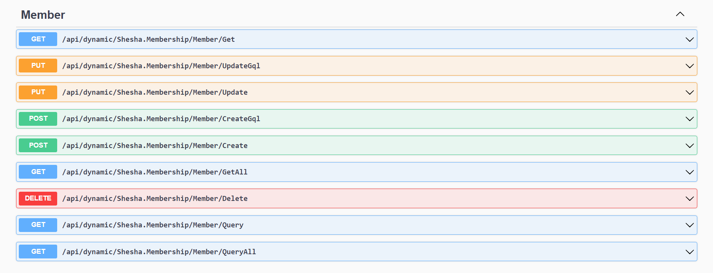

_Read more about dynamic APIs [here](/docs/back-end-basics/crud-apis)_

## Updating Configurations

Now that we have fully extended our domain model, it is time to go back and update our views so that we can reference our newly created fields in the `Member` entity.

This can be done by updating the Model Type property in all our views from `Shesha.Domain.Person (Shesha.Core.Person)` to `Shesha.Membership.Common.Domain.Member (Mem.Member)`, changing CRUD endpoints to point to the relevant model type, and adding the following fields:

    - MembershipNumber - `Textfield`: `string`
    - MembershipStatus - `RadioButton`: `RefListMembershipStatuses`
    - MembershipStartDate - `Datefield`: `DateTime`
    - MembershipEndDate - `Datefield`: `DateTime`
    - IdDocument - `File`: `StoredFile`

## Create View

1. Navigate to the `member-create` [form designer](/docs/get-started/tutorial/the-basics/configuring-first-view#accessing-form-designer)
2. Select `Settings` and change the `Entity` to `Shesha.Membership.Common.Domain.Member (Mem.Member)`

With the addition of properties to our entity, to facilitate for an overall cleaner and more managable UI, we are going to be utilizing a `wizard` component for properly delinating the different sections of information required for the member registration.

_You can find more information about implementation of the wizard component [here](/docs/front-end-basics/form-components/data-entry/wizard)_

3. Search and drag in a `wizard` component from the `Builder Widgets`
4. Drag in all the existing components onto the `wizard` component's draggable area


5. `Configure Wizard Steps` to rename the default `Step 1` and add an additional step to the wizard:
   - Biographical Information
   - Membership Information

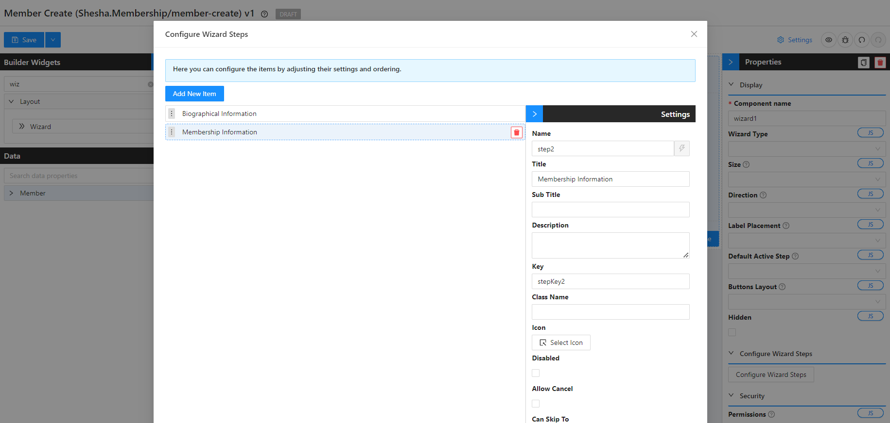

6. Update the `Membership Information` step's `Done` button to the following:

   - After Done Action: `Execute Script` >

```javascript
(function () {
  const PATH = `/api/dynamic/Shesha.Membership/Member/Create`;

  http.post(`${PATH}`, data).then(onSuccess).catch(onError);
})();

function onSuccess(resp) {
  // Navigate to details view of the created member
  window.location.href = `/dynamic/Shesha.Membership/member-details?id=${resp.data.result.id}`;
}

function onError(_e) {
  message.error(`Failed to create member: ${_e}`, 10);
}
```

7. While on the `Biographical Information` step of the wizard, search and drag in the `File` component from the `Builder Widgets`.

_You can find more information about implementation of the file component [here](/docs/front-end-basics/form-components/data-entry/files)_

8. Configure the `File` component with the following:

   - Property Name : `idDocument`
   - Label : `Id Document`
   - Owner Id: _leave empty_

9. While on the `Biographical Information` step of the wizard, search and drag in the `Entity Picker` component from the `Builder Widgets`.

_You can find more information about implementation of the entity picker component [here](/docs/front-end-basics/form-components/data-entry/entity-picker)_

10. Configure the `Entity Picker` component with the following:

   - Property Name : `address`
   - Label : `Address`
   - Entity Type: `Shesha.Domain.Address (Shesha.Core.Address)`

11. `Configure Columns` of the wizard to include the following columns:
   - addressLine1
   - suburb
   - town


One of the `Entity Picker` components many benefits is that it provides the flexibility to allow the addition of a new record, should the `address` entry not exist in any of the existing records brought back from the backend. To tap into the full functionality, we need to go create a form that will allow us to enter the details of the new address entry.

**In another tab, go create a new form with the following information:**

- Module: `Shesha`
- Template: `form-view`
- Name: `address-create`
- Label: `Address Create`
- Description: `This create view is used to create a new address`
- Model Type: `Shesha.Domain.Address (Shesha.Core.Address)`

Once on the form designer, on the `Data Panel`, drag and drop properties onto the `Edit Area` and autocomplete or change the labels accordingly:

- addressLine1
- suburb
- town

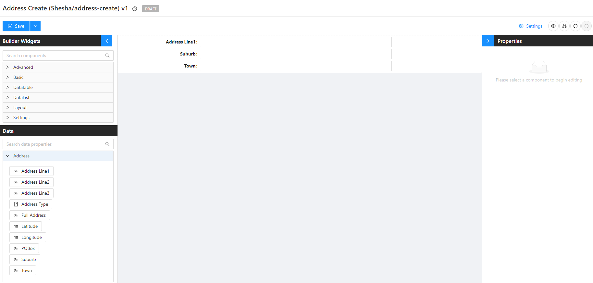

Save your form and head back to the `member-create` form designer

10. Select the `Entity Picker` component > `Allow New Record`
11. Populate the `Dialogue Settings` with the following:

- Title: `Add Address`
- Modal Form: `address-create`
- Show Modal Buttons: `true`

12. Click on the `next` button on the `Wizard` component to go to the next step.

13. On the `Data Panel`, drag and drop properties onto the `Edit Area` and autocomplete or change the labels accordingly:

    - membershipNumber
    - membershipStartDate
    - membershipEndDate
    - membershipStatus


14. Add additional validations on the `membershipStartDate` and `membershipEndDate` properties by selecting the respective `DateField` components and configure the following:

    - Disabled Date Mode: `Function Template`
    - Disabled Date Template: `Disable Past Dates`


15. Save your form

## Table View

1. Navigate to the `members-table` [form designer](/docs/get-started/tutorial/the-basics/configuring-first-view#accessing-form-designer)
2. Select `Settings` and change the `Entity` to `Shesha.Membership.Common.Domain.Member (Mem.Member)`


3. Select the `Datatable Context` component and change the `Entity Type` to `Shesha.Membership.Common.Domain.Member (Mem.Member)`

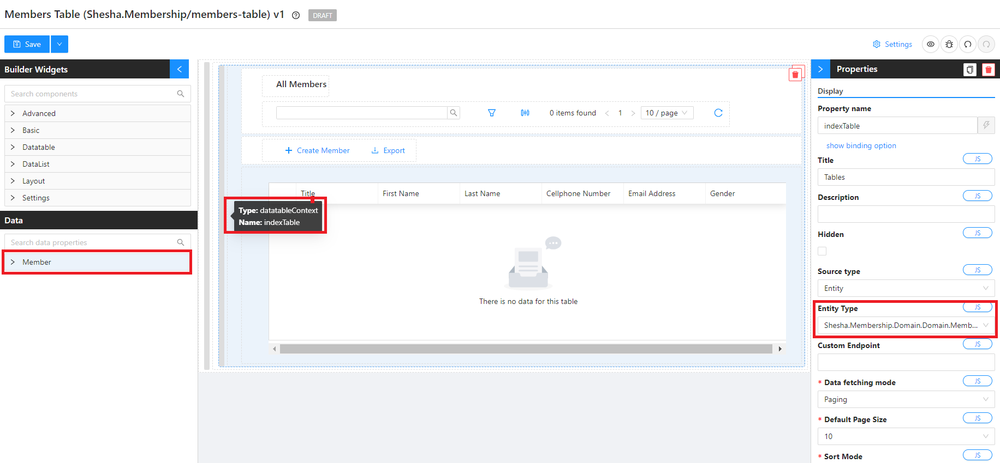

4. Select the `Datatable` component > `Customize Columns` to add the relevant columns

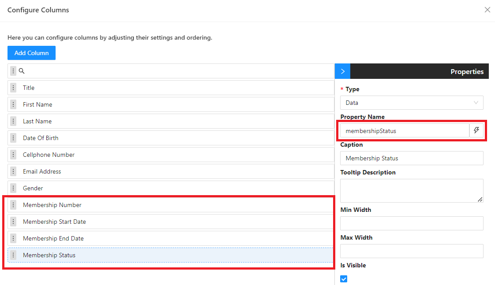

5. Select the `Button Group` component on the `toolbar` to customize the `Create Member` button
6. Update the `Create Member` button configurations by seeting the `Button Type` property to `None`.

_This is because we will be using the default `wizard` buttons that were configured on the `member-create`._

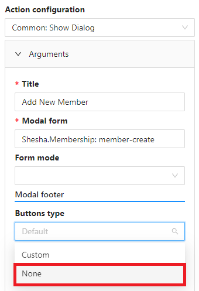

7. Save your form

## Details View

1. Navigate to the `member-details` [form designer](/docs/get-started/tutorial/the-basics/configuring-first-view#accessing-form-designer)
2. Select `Settings` and change the `Entity` to `Shesha.Membership.Common.Domain.Member (Mem.Member)`

With the addition of properties to our entity, to facilitate for an overall cleaner and more managable UI, we are going to be utilizing a `tab` component for properly delinating the different sections of the membership information.

_You can find more information about implementation of the tab component [here](/docs/front-end-basics/form-components/Layouts/tabs)_

3. Search and drag in a `tab` component from the `Builder Widgets` onto the `details` panel
4. Drag in all the existing components onto the `tab` component's draggable area

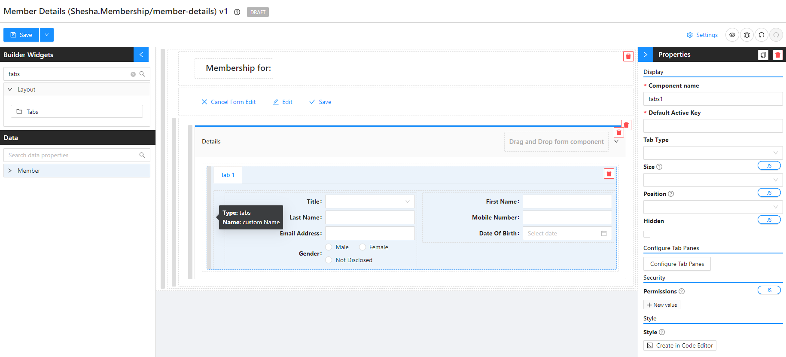

5. `Configure Tab Panes` to rename the default `Tab 1` and add an additional tab.

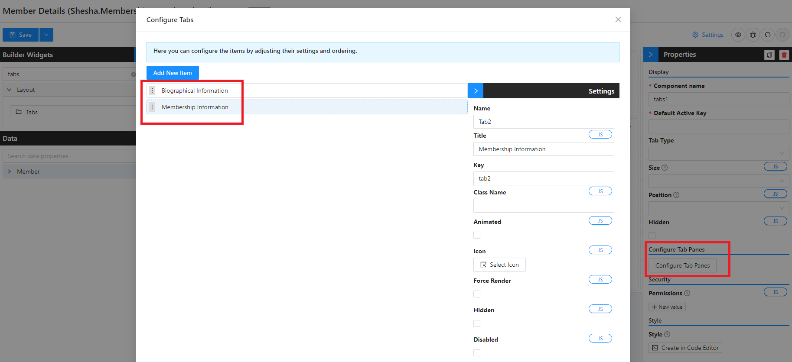

6. While on the `Biographical Information` tab, search and drag in the `File` component from the `Builder Widgets`.

_You can find more information about implementation of the file component [here](/docs/front-end-basics/form-components/data-entry/files)_

7. Configure the `File` component with the following:

   - Property Name : `idDocument`
   - Label : `Id Document`
   - Owner Id: `{data.id}`
   - Owner Type: `Shesha.Membership.Domain.Domain.Member`

- Viewing the details of a foreign key on a details view can be achieved in a number of ways:
  - [Autocomplete](/docs/front-end-basics/form-components/data-entry/autocomplete)
  - [Entity Picker](/docs/front-end-basics/form-components/data-entry/entity-picker)
  - [Entity Reference](/docs/front-end-basics/form-components/data-entry/entity-reference)
  - [Sub Form](/docs/front-end-basics/form-components/data-entry/subform)

_For the purposes of this tutorial, we are going to be utilizing the `Entity Reference` component_

8. While on the `Biographical Information` tab, search and drag in the `Entity Reference` component from the `Builder Widgets`.

_You can find more information about implementation of the entity reference component [here](/docs/front-end-basics/form-components/data-entry/entity-reference)_

9. Configure the `Entity Reference` component with the following:

   - Property Name : `address`
   - Label : `Address`
   - Get Entity Url : `/api/dynamic/Shesha/Address/Get`
   - Entity Type : `Shesha.Domain.Address (Shesha.Core.Address)`
   - Display Property : `fullAddress`
   - Entity Reference Type: `Modal Dialog Box`
   - Form Selection Mode: `Name`
   - Form: `address-create`
   - Dialog Settings:
     - Title: `Address`
     - Show Modal Buttons: `true`
     - Submit Http Verb: `PUT`
     - Handle Success: `Designer Form` > `Refresh`

_This will render the address details on a dialog and allow for editing and updating the address entry on the rendered dialog_

10. Click on the `Membership Information` tab on the `tab panel` to go to the next tab.

11. On the `Data Panel`, drag and drop properties onto the `Edit Area` and autocomplete or change the labels accordingly:

    - membershipNumber
    - membershipStartDate
    - membershipEndDate
    - membershipStatus

To further personalize the membership details view, let's make some changes to our `header` section.

11. Select the `text` component used for the title and change the `content` property to `{{fullName}} - {{membershipNumber}}`

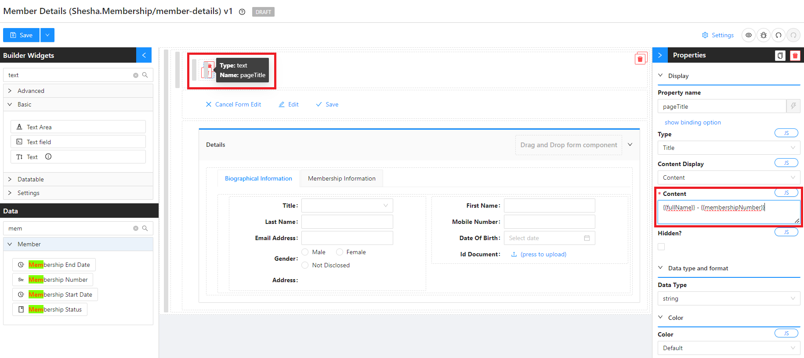

12. Search and drag in the `Reference List Status` component from the `Builder Widgets` next to the `text` title component

_You can find more information about implementation of the reference list status component [here](/docs/front-end-basics/form-components/data-display/reference-list-status)_

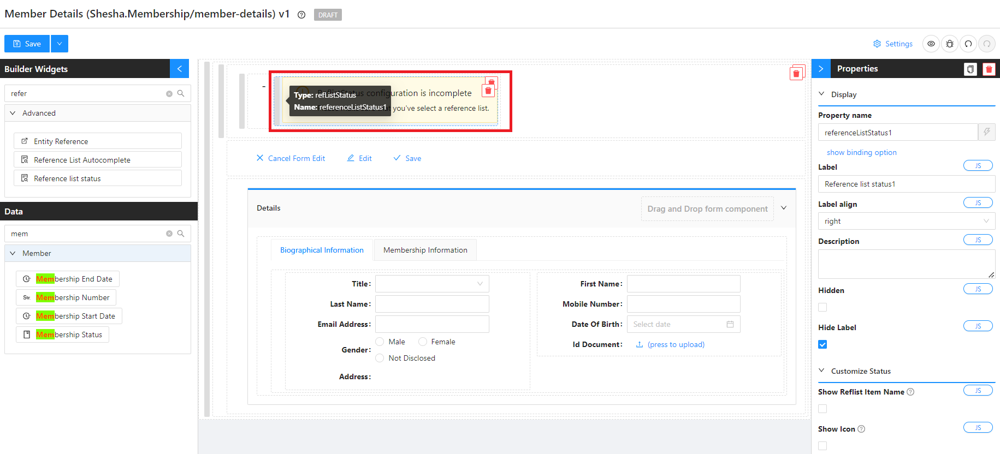

7. Configure the `Reference List Status` component with the following:

   - Property Name : `membershipStatus`
   - Reference List: `MembershipStatuses`

8. Save your form

_Let's test out our new changes!_

- Using the main menu, navigate to the `members-table` and refresh your page to make sure your changes have taken effect.
- Register a new member!

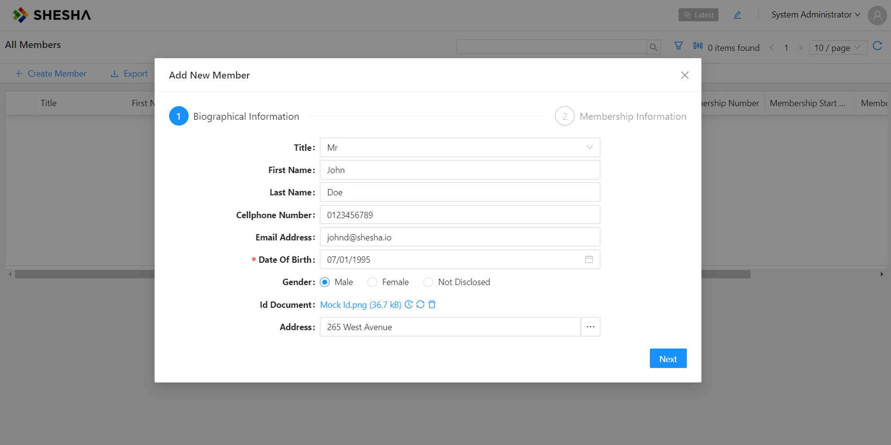


