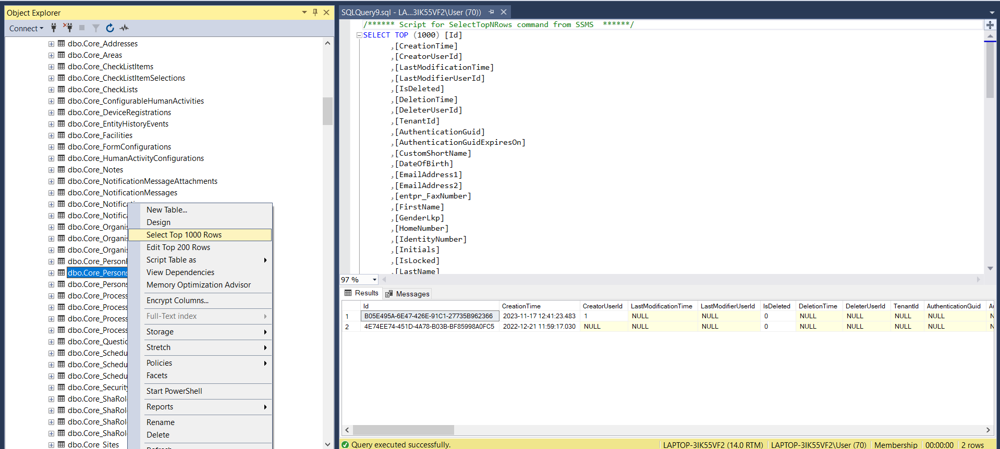
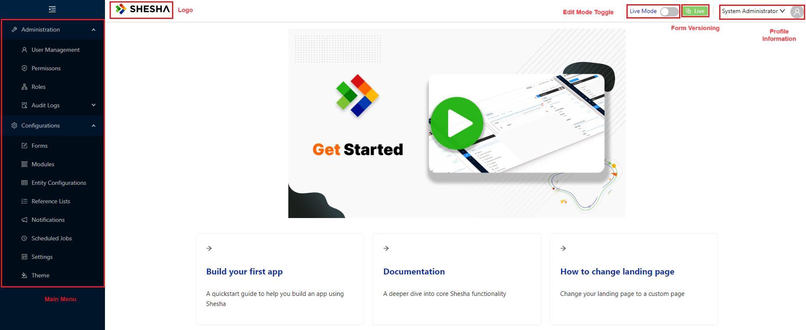

# Setting Up

## 1. Download the Shesha Starter Template:

- Customize the Namespace of the starter project by providing parameters. It is important to note that there should be no spacing in both the inputs. For example:
  - **Company Name**: `Shesha`
  - **Project Name**: `Membership`
- The Namespace of the solution will start with `Shesha.Membership`.

- Unzip the folder generated to your preferred destination.
- The zip file includes:
  - **Adminportal (Frontend)**: A React.js solution for the front end
  - **Backend**: An ASP.NET Core solution for the backend
  - **Database**: A seeded SQL database with sample data

## 2. Setup the Database (SQL Server Management Studio) - From a .bacpac file:

1.  Open `Microsoft SQL Server Management Studio`
2.  Right-click `Databases`
3.  Select `Import Data-tier Application`... and then click Next
4.  Click Browse, locate your `Membership.bacpac` file, and click Next
5.  In the `New database` name field, type `Membership` and click Next
6.  Click `Finish` in the Summary step
7.  Verify the successful import by navigating to the generated `database > Tables > dbo.Core_Persons` and querying the top 1000 rows.

## 3. Setup the Backend (Visual Studio):

- Open the starter project folder
- Navigate to the backend folder and open it
- Double click the `Shesha.Membership.sln` solution (or your project name) with Visual Studio 2022
- Connect the database to the backend and run the solution:
  1.  If your database is not named 'Membership' in SQL, in `Shesha.Membership.Web.Host` update `appsettings.json` with your database connection string.
  2.  Run your application by selecting `Debug > Start Debugging` or by clicking `F5`
  3.  The application should open in your browser on the default Swagger API page.

## 4. Setup the Frontend (Visual Studio Code):

- Open Microsoft Visual Studio Code
- Navigate to `File > Open Folder` and open the adminportal folder from your downloaded starter project
- Open a new terminal by going to `Terminal > New Terminal`
- Check if you have Node.js version `20.11.1` installed by running `node -v`
- Install node_modules by running `npm i` in the terminal
- Run your frontend application by typing `npm run dev` in your terminal
- To login to the admin portal, use the username `admin` and password `123qwe`
- Once logged in, you have your first Shesha application running successfully.
- The home page should look like the following:

