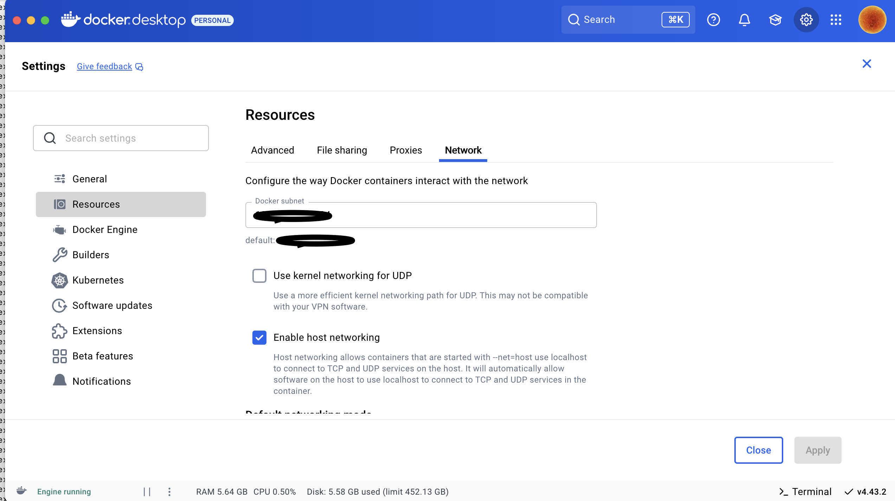

# Mac OS Setup

This guide explains how to set up your Mac OS environment to run Shesha applications locally, including both the backend (.NET) and frontend (React.js), with Microsoft SQL Server running in Docker.

## Tools You Need

- **Git** – Required for accessing code from git-based version control systems.
- **Docker** – Used to run Microsoft SQL Server as a containerized application.
- **.NET 8 SDK & Runtime** – Needed for the backend (ASP.NET Core) and for SQL-Package to work.
- **Node.js 22** – Required to run the Shesha frontend (React.js).
- **SQL-Package** – Imports the starter database from a `.bacpac` file.
- **Visual Studio Code** (or an AI-infused fork) – Recommended IDE for editing both frontend and backend code. *(Note: Visual Studio is no longer supported on Mac OS)*.
- **Azure Data Studio** – To connect to SQL Server, browse databases, and run queries.

> **Tip:** Some commands may require administrator privileges. In that case, prefix them with:
> ```bash
> sudo ...
> ```

## 1. Download & Install Docker

Download Docker Desktop for Mac from [docker.com](https://www.docker.com) and install it.  
Once Docker is running, you can use `docker` commands in the terminal to create, start, stop, and manage containers.

For more details:  
[Quickstart: Install and connect to SQL Server in Docker](https://learn.microsoft.com/en-us/sql/linux/quickstart-install-connect-docker?view=sql-server-ver17&tabs=cli)


### 1.1 Pull SQL Server Image
```bash
docker pull mcr.microsoft.com/mssql/server:2022-latest
```

### 1.2 Run the Container
Once the SQL Server image is downloaded, create a container:

```bash
docker run -d -e "ACCEPT_EULA=Y" -e "MSSQL_SA_PASSWORD=@123Shesha" \
-p 1433:1433 --name SQL_Server_Docker \
mcr.microsoft.com/mssql/server:2022-latest
```

After running this command, SQL Server will be running in a container with the following credentials:

- **User ID:** `sa`  
- **Password:** `@123Shesha`

### 1.3 Enable Host Networking in Docker
Make sure to enable **host networking** in Docker Desktop so that your machine’s network calls can access the container’s network:



---

## 2. Importing the Starter Database into SQL Server

On Windows, we could use Microsoft SQL Server Management Studio's *Import Data-tier Application* wizard. On Mac OS, we use **SQL-Package** instead.

### 2.1 Install .NET 8
If not already installed, download the Arm64 (Apple Silicon) or x64 (Intel) version here:  
[.NET 8 Download](https://dotnet.microsoft.com/en-us/download/dotnet/8.0)

### 2.2 Install SQL-Package
```bash
dotnet tool install -g microsoft.sqlpackage
```

After installation, follow the terminal instructions to add SQL-Package to your PATH.  
Close and reopen your terminal after installation.

Documentation: [Install SQL-Package](https://learn.microsoft.com/en-us/sql/tools/sqlpackage/sqlpackage-download?view=sql-server-ver17)

### 2.3 Creating the Shesha Starter Project
1. Download the [Shesha Starter Template](https://www.shesha.io/download-shesha?_gl=1*1brs2vj*_ga*NTYwNjU0MjAxLjE3NTQ0NzMwMDE.*_ga_NKYL5VXNHY*czE3NTQ0NzMwMDAkbzEkZzEkdDE3NTQ0NzMyNjEkajMxJGwwJGgw), which contains:
   - **Adminportal** – React.js frontend
   - **Backend** – ASP.NET Core backend
   - **Database** – Seeded SQL Server `.bacpac` file

2. Unzip the project and note the directory path.

> **Naming note:** Replace placeholders like `ProjectName` and `OrganisationName` with the actual names you chose when generating the starter project.

### 2.4 Importing the Database
In the unzipped project directory, you will find a `.bacpac` file:

**Example location:**
```
~/Downloads/<OrganisationName.ProjectName>/<ProjectName>.bacpac
```

Run:
```bash
sqlpackage /Action:Import /SourceFile:"./Downloads/<OrganisationName.ProjectName>/<ProjectName>.bacpac" /TargetConnectionString:"Server=localhost,1433;Initial Catalog=ProjectName;Persist Security Info=False;User ID=sa;Password=@123Shesha;MultipleActiveResultSets=False;Encrypt=True;TrustServerCertificate=True;Connection Timeout=30;"
```

Once complete, open Azure Data Studio and verify that the `ProjectName` database exists.

---

## 3. Running the Backend

### 3.1 Open Backend in VS Code
Open the `backend` directory in your code editor.

### 3.2 Update Connection String
Edit:
```
/src/OrganisationName.ProjectName.Web.Host/appsettings.json
```
Replace the `Default` connection string:
```json
{
    "ConnectionStrings": {
        "Default": "Server=localhost,1433;Initial Catalog=ProjectName;Persist Security Info=False;User ID=sa;Password=@123Shesha;MultipleActiveResultSets=False;Encrypt=True;TrustServerCertificate=True;Connection Timeout=30;"
    }
}
```

### 3.3 Build & Run
**Working directory structure:**
```
backend
├── src
├── nupkg
├── .nuget
├── test
└── ...
```

Build:
```bash
dotnet build
```

Run:
```bash
dotnet run --project src/OrganisationName.ProjectName.Web.Host --urls "http://localhost:21021;https://localhost:44362"
```

> **SSL Note:** If you do not have a local development certificate, install and trust it:
> ```bash
> dotnet dev-certs https --trust
> ```

---

## 4. Running the Frontend

Go to the `adminportal` directory:
```bash
cd adminportal
npm install
npm run dev
```

The frontend should now be running locally and connected to your backend.

## 🎉 You're Ready to Go!

