Shesha adopts a permission-based model, which means users can only perform restricted actions if they've been granted that specific permission. Think of it like having different keys for different doors in a building - you can only enter the rooms you're authorized to access.

This article assumes you have configured your Shesha project so that it’s up and running. If you haven’t, no worries, you can easily set up your project [here](../get-started/tutorial/the-basics/setting-up/).

First, from the homepage, navigate to the **Permissions Configurator** by clicking on the **Permissions** Button. 

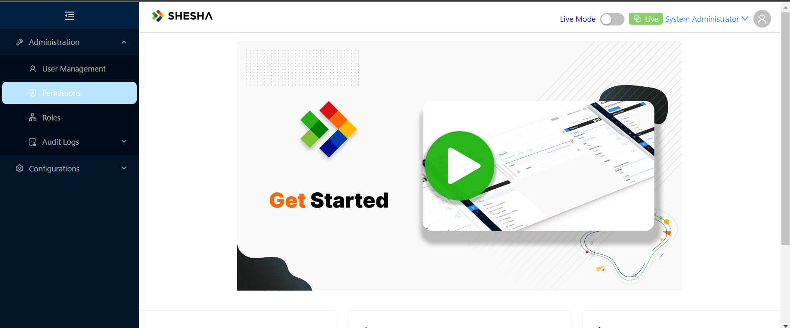

On the **Permission Configurator** page, you can create a new Permission by clicking the **Create root** button. 

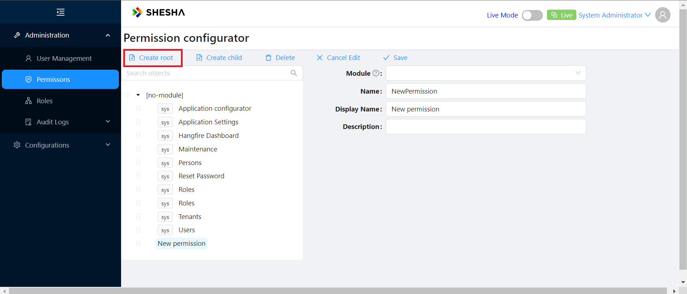

This opens a modal that allows you specify;
1.	The Module you want to apply the permission to.
2.	The actual name of the permission.
3.	The display name of the permission (as seen in the modal with the other permissions)
4.	A description of what that permission does.

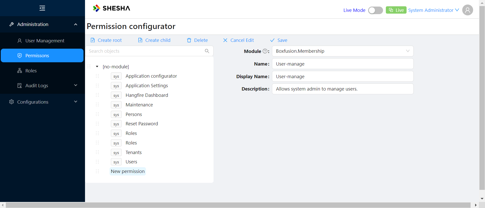

After specifying this information, click the **Save** button to save the new permission.
The new permission is created and can be seen from the Permissions list.

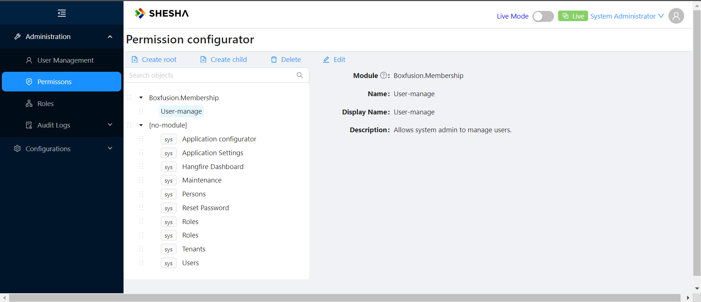

You can also choose to define a Permission without a module

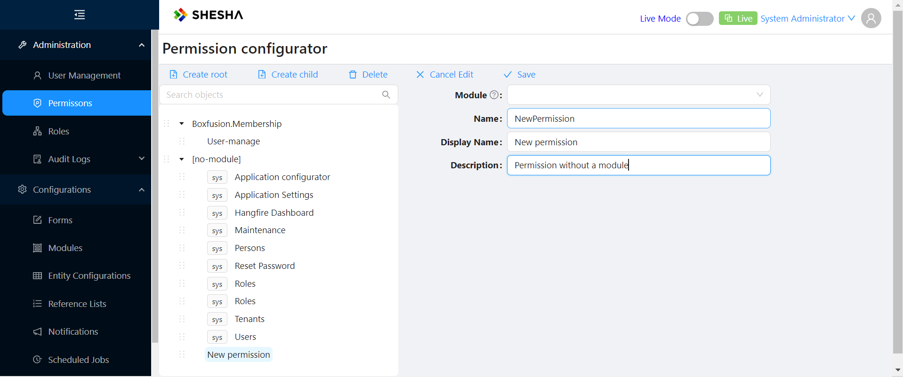

When this new Permission is saved, you’ll find it under the **no-module** section in the list of permissions

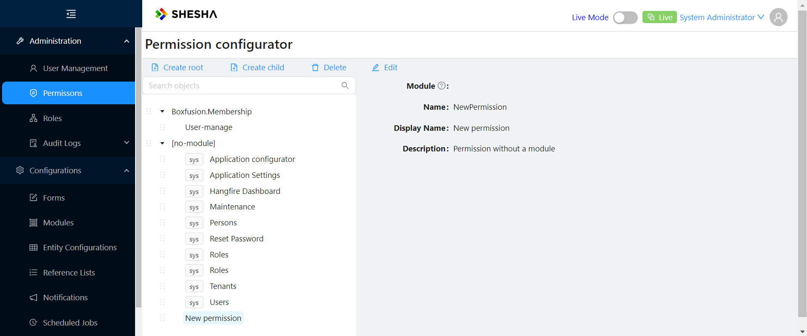

Okay great, next we want to assign the newly created permission to a role in the system.
Navigate to the Roles Modal by clicking the button **Roles**, to see available roles

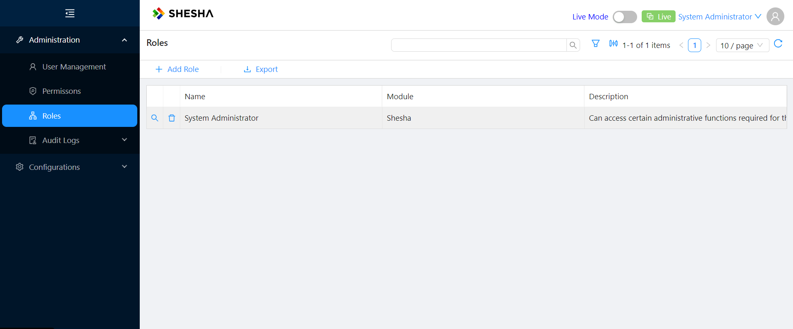

We see there’s a **System Administrator** role available. Let’s assign the newly created permission to this role.
Click on the magnifier icon so we can edit this role.

Then, click on the **Edit** button

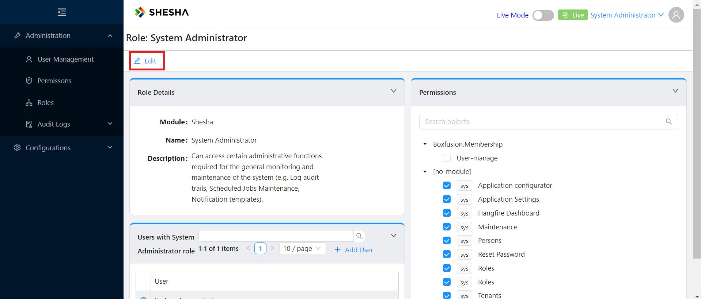

You can then select the checkbox of the newly created permission and click **Save**

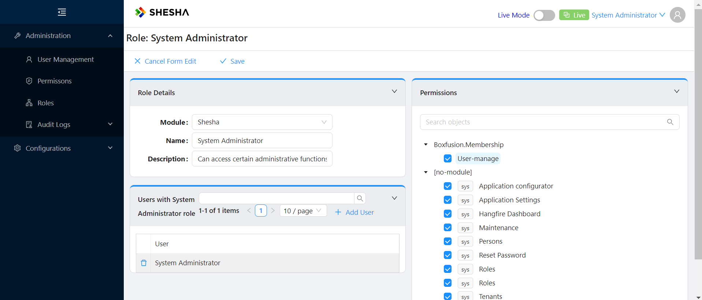

Now, we want to make sure the administration menu group is only available to users who have the role with the permission we have just created.
To do this, we will need to enable **Edit mode**. 
Click on **Live Mode** toggle button to switch to **Edit Mode**

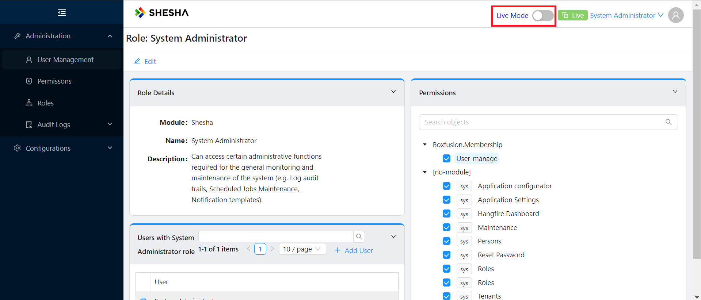

After clicking the toggle button, you should see top menu bar change and a notification that the application has been switched to **Edit Mode**

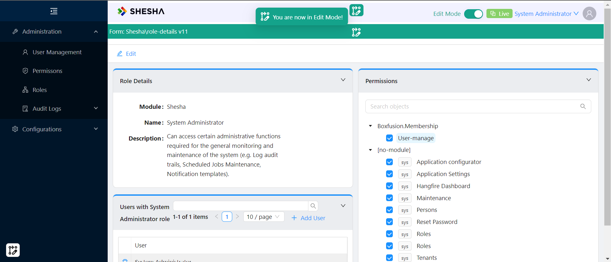

While in **Edit Mode**, click on the **Permission** button in the side bar once again to bring up the edit mode permission modal

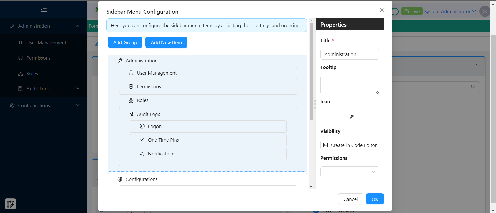

And then add the newly created Permission to the Role group

And that’s it 🥳 We've boosted your application's security by adding an exciting new permission to a role. Your views are now even safer and better protected!

*PS: Assigning permissions also applies to various form components that exist within a form*.

This how-to equipped you to harness Shesha's powerful Authentication and authorization capabilities to make your application more secure. But Shesha offers so much more! Head over to the [docs](../get-started/Introduction/) to see all the cool things you can do firsthand — and the best part? You'll achieve more while writing less code!

Happing (low) Coding.

### See Also:

-[Copy Form](copy-form)